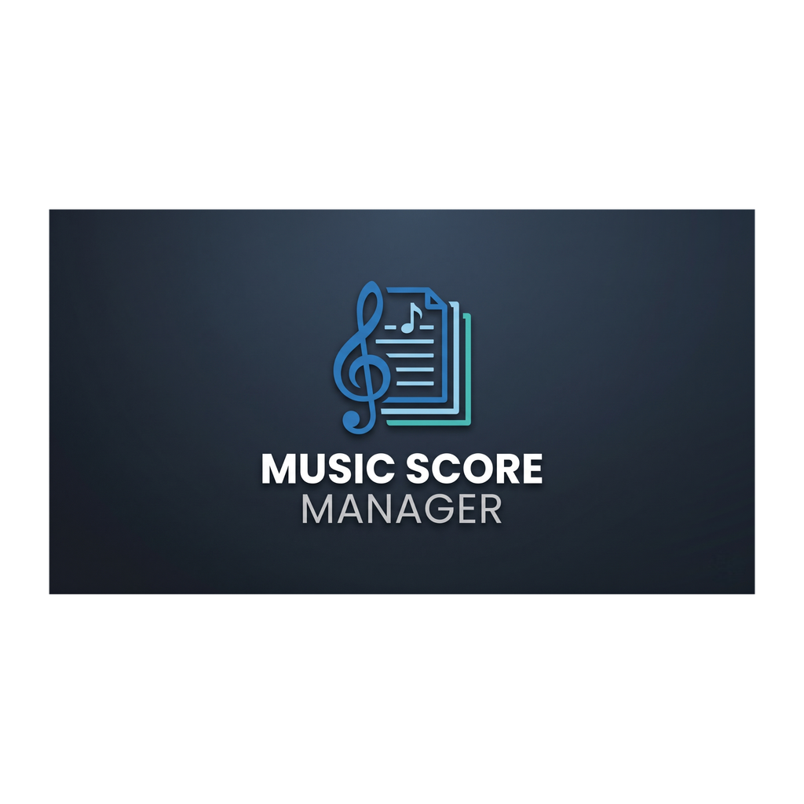

<p align="center">
  
</p>

# Music Score Manager v1.9.0

**Music Score Manager** est une application mobile multiplateforme construite avec **.NET MAUI** (ciblant principalement Android) conçue pour les musiciens afin de gérer, organiser, annoter et visualiser leurs partitions (PDF et Images) de manière efficace, particulièrement en situation de concert.

---

## 🚀 Fonctionnalités Clés

### 📦 Envoi & Export Complet de Setlists et Packages (v1.9.0)
- **Envoi Sans Fil de Setlists Complètes (Bluetooth P2P)** : Transmettez une setlist entière avec son ordonnancement exact et toutes ses partitions rattachées directement d'un appareil à l'autre sans Internet.
- **Boîte de Dialogue avec Options d'Envoi** : Choisissez précisément avant l'envoi d'inclure ou non vos annotations (doigtés, surlignages, textes) et les pistes audio (MP3/WAV) rattachées.
- **Export & Import de Packages Autonomes (`.msmsetlist`, `.msmscore`, `.msmscores`)** : Générez des archives complètes réimportables en 1 clic sur n'importe quel autre appareil dans l'onglet **Outils**.
- **Répertoire d'Export Configurable** : Définissez librement dans les *Paramètres Application* le dossier où vos fichiers d'exports sont déposés et accédez-y facilement par USB ou explorateur de fichiers.
- **Harmonisation UI "Envoyer"** : Remplacement unifié du terme "Échanger" par "Envoyer" dans les 8 langues prises en charge.

### ⏱️ Métronome Temps Réel Haute Précision & Contrôle du Son (v1.8.22 - v1.8.26)
- **Régularité Absolue & Moteur Thread-Safe (v1.8.26)** : Verrouillage atomique du thread d'horloge pour empêcher tout conflit de tempo. Cadence rigoureusement métronomique et fluide avec double temporisation fine (`Thread.Sleep` + `SpinWait`) et synchronisation visuelle LED découplée.
- **Contrôle On/Off du Son dans le Menu Central (v1.8.26)** : Possibilité d'activer ou de couper le son du métronome à la volée directement depuis le menu central de la partition, tout en conservant l'option assignée par défaut à la partition.
- **Latence Matérielle Instantanée (SoundPool Android)** : Lecture des sons de clic et de pré-compte via `SoundPool` pré-chargé en mémoire vive sans instanciation ni décodage en cours de jeu.
- **Pré-compte Synchronisé au Microseconde Près** : Décompte avant démarrage audio rigoureusement calé sur la pulsation du morceau.

### 🔍 Zoom & Gestes Tactiles Avancés (v1.8.0 - v1.8.19)
- **Zoom Unifié & Synchronisation Parfaite des Stickers (v1.8.19)** : Zoom et pan unifiés sur `ZoomLayout` pour PDF et Images. Les stickers (annotations) suivent le zoom et le déplacement en temps réel avec une proportion et un alignement millimétrique sur les portées musicales.
- **Ergonomie & Gestes de Tourne-Page Personnalisables (v1.8.18)** : Configuration sur mesure des gestes pour page suivante (glisser à gauche, taper à droite, glisser vers le haut) et page précédente (glisser à droite, taper à gauche, glisser vers le bas) dans les Paramètres Partitions.
- **Fluid & Precision Zoom** : Zoom dynamique et pan fluide pour les partitions au format Image et PDF.
- **Rendu PDF Ultra-Rapide avec Pré-rendu (v1.8.14)** : Pré-rendu hors-écran (*Offscreen Canvas Cache*) des pages adjacentes pour des sauts de page instantanés à 0 ms de latence.
- **Rotation Hybride par Page (v1.8.14 - v1.8.17)** : Choix flexible de pivoter une page spécifique à 90° ou toute la partition, avec persistance SQLite dédiée et synchronisation temps réel par page.
- **Indicateur Cadenas Annotations** : Visualisation claire avec fond rouge (verrouillé) et vert (déverrouillé).
- **Métadonnées de Fichier Complètes (v1.8.15 - v1.8.21)** : Affichage de la taille du fichier, de sa date de dernière modification, de son horodatage d'ajout et de son **type précis avec extension** (ex: *PDF (.pdf)*, *Image (.png)*) dans la page d'édition.
- **Sécurisation des Gestes (Safe Boundaries)** : Gestion intelligente des zones tactiles pour éviter les sorties d'écran et la navigation intempestive aux extrémités de la partition.
- **Intégration des Étiquettes dans l'onglet Outils (v1.8.30)** : Fusion complète de la gestion des étiquettes (création, recherche, modification, suppression) sous forme de chapitre dédié dans **Outils** aux côtés de la **Gestion des sauvegardes**.
- **Menu Principal Optimisé à 5 Onglets Stricts (v1.8.30)** : Barre de navigation épurée (`[Partitions] [Setlists] [Outils] [Paramètres] [Quitter]`) éliminant définitivement l'apparition du menu « More / Plus » sur les interfaces mobiles et tablettes.
- **Page « À propos » Dédiée (v1.8.29)** : Présentation officielle de l'application avec logo, version dynamique, détails de la licence MIT, liste exhaustive des licences des frameworks utilisés (.NET MAUI, CommunityToolkit, SQLite, PDF.js) et lien direct vers le projet Open Source sur GitHub.
- **Moteur de Localisation Multilingue (v1.8.29)** : Chapitre *Langue* ajouté dans les *Paramètres Application* (avant Bibliothèque) avec sélecteur intuitif. Prise en charge initiale de 4 langues (🇫🇷 Français, 🇬🇧 Anglais, 🇩🇪 Allemand, 🇪🇸 Espagnol). Architecture structurée avec fichiers de traduction JSON indépendants (`Resources/Raw/Languages/*.json`) pour une maintenance et un ajout de nouvelles langues facilités.
- **Menu Quitter Intégré & Suppression de la Croix (v1.8.28)** : Ajout de l'onglet `Quitter` (`🚪`) directement dans la barre de navigation principale à droite de Paramètres pour une fermeture propre et immédiate de l'application. Suppression de l'ancienne croix discrète sur la page Partitions.
- **Message d'État de Chargement Évolué (v1.8.28)** : Affichage explicite de *"Chargement des partitions en cours..."* lors de l'initialisation de l'application ou d'une recherche, et *"Aucune partition trouvée."* uniquement lorsqu'aucune partition n'est présente dans la base.
- **Accès Direct au Saut de Page** : Clic direct sur l'indicateur de numérotation de page (`1/5`) pour ouvrir le prompt de changement de page.

### 🎨 Édition & Système d'Annotations Dynamiques (v1.8.1 - v1.8.27)
- **Mode Dessin & Annotations au Crayon (v1.8.27)** : Nouvel outil `✎` interactif permettant de dessiner librement à main levée au doigt sur la partition. Tracé opaque (100% au premier plan pour masquer les éléments désirés). Palette de 6 couleurs (Noir, Rouge, Bleu, Vert, Jaune, Blanc) et 5 épaisseurs de trait (1mm, 2mm, 3mm, 4mm, 5mm). Support complet de la sélection, suppression au double-tap et de l'historique Undo/Redo.
- **Historique Dynamique Undo / Redo (v1.8.25 - v1.8.27)** : Nouveaux boutons `↩` (Annuler) et `↪` (Rétablir) intégrés directement dans la barre d'outils d'annotations. Permet d'annuler et rétablir instantanément n'importe quel dessin au crayon, surlignage, ajout ou suppression de sticker.
- **Surlignage Stabilo à Bords Droits / Biseautés (v1.8.25)** : Extrémités de sélection nettes et droites (`PenLineCap.Flat`) remplaçant l'effet arrondi pour un rendu de surlignage authentique et précis sur les portées et textes.
- **Pipeline Tactile Natif & Surlignage Stabilo Temps Réel (v1.8.24)** : Capture matérielle directe des événements tactiles Android. Tracé instantané et fluide du surlignage au doigt (`🖍`) sur PDF et Image sans blocage ni latence. Restauration complète du zoom/dézoom multi-touch (Pinch à 2 doigts) et du déplacement (Pan) sur les partitions PDF.
- **Surlignage Translucide Tactile / Stabilo (v1.8.23 - v1.8.25)** : Outil `🖍` avec rendu translucide naturel (sans masquer les notes et annotations sous-jacentes). Palette ergonomique de 4 couleurs fluo et 3 épaisseurs de trait (5 mm, 10 mm, 18 mm).
- **Harmonisation Typographique & Rendu Anti-Rognage des Stickers (v1.8.31)** : Échelle typographique affinée (taille de base 15px au lieu de 24px) pour des annotations musicales et textuelles nettes et parfaitement proportionnées. Marges dynamiques de sécurité évitant toute troncature/coupure de texte sur Android. Refonte visuelle du tiroir avec boutons de catégories en pilules et pastilles stickers bold parfaitement centrées.
- **Tiroir à Stickers Unifié & Bouton Fermer ✕** : Sélection rapide avec bouton de fermeture dédié sur l'overlay.
- **Réglette de Taille Tactile Élargie** : Slider grand format ergonomique sur ligne dédiée pour un ajustement facile aux doigts.
- **Placement Délimité Précis (v1.8.12)** : Possibilité de déposer des stickers en dessous de la barre d'annotations même si celle-ci a été déplacée au milieu/haut de l'écran.
- **Verrouillage Strict (Lock Safety)** : Interdiction d'ajouter ou modifier des stickers si le cadenas est verrouillé avec message d'information explicite.
- **Édition Temps Réel** : Modification dynamique en mode déverrouillé (couleurs texte/fond et taille).

### ⚡ Performance "Zero-Copy" & Cache Setlists (v1.0.1 - v1.1.1)
- **Mise en Cache Automatique** : Les setlists sont pré-chargées en tâche de fond dans un stockage ultra-rapide.
- **Résilience du Cache** : Tolérance aux fichiers inaccessibles sans interruption du flux principal.
- **Chargement Direct** : Suppression des copies disques lors de l'ouverture d'un PDF pour une transition instantanée entre morceaux.
- **Indicateur de Statut** : Visualisation en temps réel de l'état du cache (⏳/⚡) dans l'éditeur de setlist.

### 🎵 Gestion des Partitions & Échange Bluetooth (v1.0.5 - v1.8.20)
- **Échange Bluetooth Unitaire & Groupé (v1.8.20)** : Option "Échanger" disponible directement dans le menu contextuel (3 points) de chaque partition ainsi qu'en mode sélection multiple.
- **Stockage Public Configurable** : Définissez vos propres répertoires pour les partitions et les fichiers audio.
- **Super-Détection & Scan Récursif** : Scan intelligent tolérant et détection automatique des fichiers déjà présents dans l'arborescence racine/sous-dossiers pour éviter la duplication.
- **Import Hybride** : Choisissez entre "Copier" (interne) ou "Lier" (externe avec icône 🔗 et option de rapatriement rapide).

### 🏷️ Système d'Étiquettes (Chips)
- **Gestion Globale** : Créez et personnalisez vos étiquettes avec des couleurs (Palette + Sliders RGB).
- **Filtrage Rapide** : Carrousel horizontal pour filtrer instantanément par catégorie.

### 📋 Gestion de Setlists (v0.2.0+)
- **Mode Édition Avancé** : Réordonnez vos partitions par **glisser-déposer**.
- **Gestion des Statuts** : Marquez vos listes comme `À venir`, `Active` ou `Terminée` avec filtrage sur l'accueil.
- **Lecture en Continu** : Transition automatique entre les morceaux d'une même liste.
- **Mode Concert (Verrouillage)** : Bouton de verrouillage persistant pour désactiver toute modification accidentelle sur scène.

### ⏱️ Métronome Pro & Audio Sync
- **Haute Précision** : Boucle temporelle basée sur `Stopwatch` sans dérive CPU.
- **Bip de Pré-compte & Synchronisation** : Son distinctif (880Hz) et calage précis du démarrage audio sur le temps fort.

### 🛡️ Gestion des Sauvegardes
- **Sauvegarde Automatique & Rétention** : Sauvegarde automatique configurable avec rétention paramétrable.
- **Restauration en un Clic** : Restaurez n'importe quelle version précédente depuis l'historique UI.

---

## 📜 Historique Récent des Versions

- **v1.8.7** : **"Performance & Precision Zoom"** — Version actuelle avec retouches d'optimisation de zoom et retours tactiles.
- **v1.8.4** : **"Safe Gesture Placement"** — Isolation anti-drop accidentel lors de l'utilisation du sélecteur d'annotations.
- **v1.8.3** : **"Dynamic Annotation Editing"** — Modification en direct de la taille, couleur de texte et fond des stickers posés.
- **v1.8.2** : **"Safe Boundaries & Native Execution"** — Blocage des retours d'écran intempestifs aux extrémités de partition.
- **v1.8.1** : **"Gesture Tuning & Annotation Clamping"** — Intégration du tiroir à stickers unifié et limitation du panoramique.
- **v1.8.0** : **"Safe Zooming & Fluid Image Zoom"** — Refonte de la couche tactile MAUI pour le zoom d'images et PDF.
- **v1.1.0** : **"Super-Detection Edition"** — Scan récursif et tolérant pour détection des doublons d'import.
- **v1.0.0** : **"Public Library Edition"** — Refonte du stockage et optimisation PDF.js.

---

## 🛠️ Stack Technique

- **Framework** : .NET 10 (MAUI)
- **Base de données** : SQLite (via `sqlite-net-pcl`)
- **Lecteur PDF** : PDF.js (injecté via WebView)
- **Lecteur Audio** : `Plugin.Maui.Audio` & `CommunityToolkit.Maui.MediaElement`
- **Compatibilité** : Android 12.0+ (API 31) minimum (Target SDK 36.0)
- **Logiciel de compilation** : Visual Studio 2022 / .NET CLI (`dotnet build`)

---

## 📂 Structure du Projet

- `/Models` : Entités (`Score`, `Setlist`, `Tag`, `ScoreTag`, `BackupFile`, etc.).
- `/Services` : Logique métier (`DatabaseService`, `SettingsService`, etc.).
- `/Converters` : Convertisseurs XAML pour l'affichage dynamique.
- `/Resources/Raw/pdfjs` : Moteur de rendu PDF interne.
- `ViewerPage.xaml(.cs)` : Lecteur principal de partitions (PDF & Images, annotations, audio & métronome).

---

## 📥 Installation & Compilation

1. Clonez le dépôt.
2. Ouvrez la solution dans Visual Studio 2022 ou utilisez la CLI.
3. Ciblez le framework `net10.0-android36.0` (ou `net10.0-windows10.0.19041.0`).
4. Lancez ou générez l'application :

```powershell
# Compilation & Exécution Debug Android
dotnet build -t:Run -f net10.0-android36.0

# Publication Release APK
dotnet publish -f net10.0-android36.0 -c Release
```

## 🔒 Politique de Confidentialité / Privacy Policy

L'application **Music Score Manager** respecte rigoureusement la vie privée de ses utilisateurs :
- **0 collecte de données personnelles** (pas d'identifiants, pas de tracking, pas de télémétrie).
- **Stockage 100% local** sur l'appareil.
- **Conformité Google Play Store** : Consultez le document complet dans [PRIVACY_POLICY.md](PRIVACY_POLICY.md).

---

**Développé par Audiothor** — *MusicScoreManager v1.9.0 "Setlist Send & Package Export/Import System, Configurable Export Directory"*
