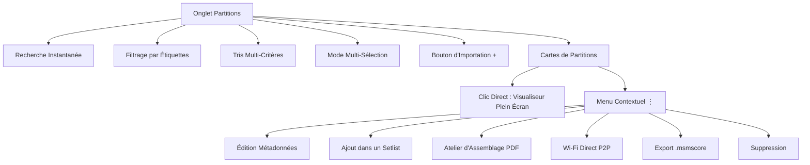
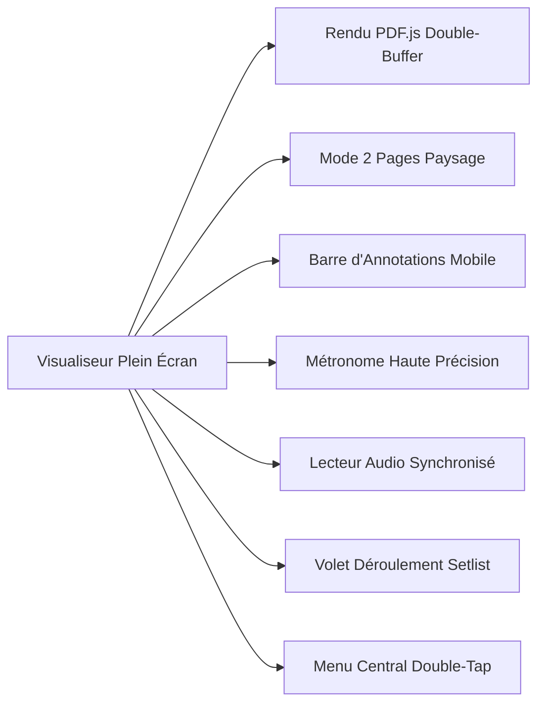
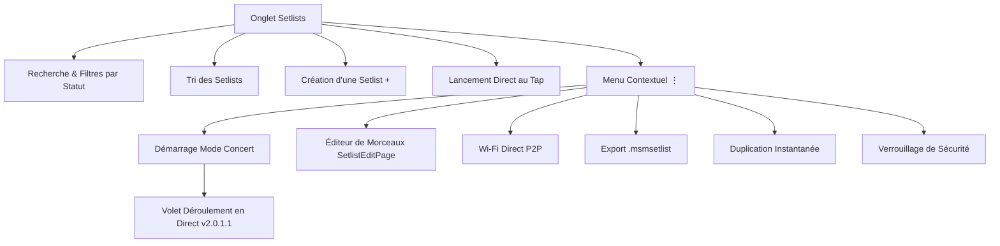
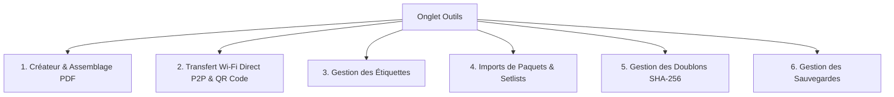
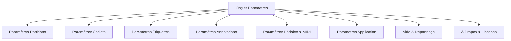

<p align="center">
  
</p>

# Music Score Manager v2.1.0
> **Le gestionnaire & visualiseur professionnel de partitions musicales pour répétitions, pupitres et concerts en direct.**

---

## 📑 Sommaire Général

1. [Chapitre 1 : Description Complète de l'Application, Installation & Prérequis](#chapitre-1--description-complète-de-lapplication-installation--prérequis)
2. [Chapitre 2 : Partitions — Actions, Bibliothèque & Visualiseur de Scène](#chapitre-2--partitions--actions-bibliothèque--visualiseur-de-scène)
3. [Chapitre 3 : Setlists — Organisation des Programmes & Déroulement Scénique](#chapitre-3--setlists--organisation-des-programmes--déroulement-scénique)
4. [Chapitre 4 : Outils — Boîte à Utilitaires Avancés](#chapitre-4--outils--boîte-à-utilitaires-avancés)
5. [Chapitre 5 : Paramètres — Personnalisation & Préférences](#chapitre-5--paramètres--personnalisation--préférences)
6. [Chapitre 6 : Détails Techniques, Confidentialité, Droits & Liens GitHub](#chapitre-6--détails-techniques-confidentialité-droits--liens-github)

---

## Chapitre 1 : Description Complète de l'Application, Installation & Prérequis

### 1.1 Présentation Générale & Philosophie
**Music Score Manager** est une application multiplateforme développée avec **.NET 10 MAUI**, principalement conçue pour les tablettes et smartphones **Android** (ainsi que les postes de travail **Windows**). Conçue par des musiciens pour des musiciens, elle répond aux exigences les plus strictes de la pratique musicale : répétitions de pupitre, travail personnel, cours de musique, répétitions générales et exécution scénique en concert live.

L'application élimine définitivement les classeurs papier volumineux et remplace les visualiseurs PDF généralistes inadaptés à la scène. Elle offre une expérience taillée sur mesure :
- **100% Hors-Ligne & Sans Dépendance Réseau** : L'ensemble de la bibliothèque, de la base de données, des métadonnées, des annotations et des fichiers audio est stocké localement sur l'appareil. Aucun accès Internet n'est requis sur scène.
- **Réactivité Instantanée (< 50 ms)** : Architecture optimisée sans copie de fichiers superflue (*zero-copy*), avec pré-rendu hors-écran (*offscreen canvas double-buffering*) pour des tournes de page sans saccade ni latence.
- **Confort Visuel Scénique** : Interface native sombre (Dark Mode `#121212`) prévenant tout éblouissement sur scène et éliminant tout flash blanc lors du chargement des partitions.
- **Contrôle Mains-Libres Intégral** : Prise en charge native des pédaliers tourne-page sans fil Bluetooth (profils HID et clavier) ainsi que des contrôleurs MIDI (USB-OTG et Bluetooth MIDI).
- **Écosystème d'Annotations Professionnel** : Stylet, crayon à main levée, surligneurs Stabilo translucides, textes typographiés et plus de 100 stickers musicaux intégrés.

---

### 1.2 Prérequis Système & Matériels

| Composant | Prérequis Minimum | Recommandé pour la Scène |
| :--- | :--- | :--- |
| **Système d'exploitation** | **Android 12.0** (API 31) ou supérieur | **Android 13 / 14 / 15 / 16** (Target SDK 36) |
| **Alternative Desktop** | **Windows 10** (build 19041+) | **Windows 11** avec écran tactile ou stylet |
| **Écran & Affichage** | Écran 8 pouces tactile | **Tablette 10.5 à 13.3 pouces** (haute définition, ratio 4:3 ou 16:10) |
| **Stockage** | 200 Mo d'espace libre pour l'application | 4 Go+ selon l'envergure de votre bibliothèque PDF/Audio |
| **Mémoire Vive (RAM)** | 3 Go de RAM | 4 Go à 8 Go de RAM |
| **Contrôleurs Pédalier** | Écran tactile | **Pédalier Bluetooth HID** (AirTurn, PageFlip, Joyo, Donner...) ou **Contrôleur MIDI** |
| **Connexion Réseau** | Aucune connexion Internet requise | Carte Wi-Fi active uniquement pour le partage direct P2P entre musiciens |

---

### 1.3 Installation & Déploiement

#### 📱 Pour Android

##### Méthode 1 : Installation via le Google Play Store (Recommandé)
C'est la méthode la plus simple, la plus rapide et la plus sécurisée :
1. Ouvrez le **Google Play Store** sur votre tablette ou smartphone Android.
2. Recherchez **Music Score Manager** (développé par *Audiothor*) ou accédez directement à la fiche du store :  
   👉 [**Music Score Manager sur Google Play Store**](https://play.google.com/store/apps/details?id=com.audiothor.musicscoremanager)
3. Cliquez sur **Installer**. Les futures mises à jour officielles seront déployées automatiquement.

##### Méthode 2 : Installation Manuelle via le Package APK (Hors-Ligne)
Pour les appareils sans Google Play ou pour une utilisation 100% autonome :
1. Téléchargez la dernière version du fichier APK signé (`MusicScoreManager-vX.Y.Z.apk`) depuis les [Releases du dépôt GitHub](https://github.com/Audiothor/MusicScoreManager/releases).
2. Sur votre appareil Android, autorisez l'installation d'applications de sources inconnues (*Paramètres > Sécurité > Installer applications inconnues*).
3. Ouvrez le fichier APK et validez l'installation.
4. Au premier lancement, accordez les permissions requises pour les fichiers multimédias, le Bluetooth (pédaliers) et la détection locale (Wi-Fi Direct).

---

#### 💻 Pour Windows (PC, Portables & Tablettes Surface)
**Music Score Manager** s'exécute nativement sous **Windows 10** (build 19041+) et **Windows 11** avec prise en charge du tactile, de la souris, du stylet et des raccourcis clavier :
1. Téléchargez l'archive Windows (`MusicScoreManager-Windows-vX.Y.Z.zip`) depuis les [Releases GitHub](https://github.com/Audiothor/MusicScoreManager/releases).
2. Extrayez l'archive dans le répertoire de votre choix (ex. `C:\Programmes\MusicScoreManager`).
3. Lancez `MusicScoreManager.exe` (vous pouvez créer un raccourci Bureau ou l'épingler à la Barre des tâches).
4. *(Si Windows SmartScreen affiche un écran de protection au 1er lancement, cliquez sur « Informations complémentaires » puis « Exécuter quand même »).*

---

#### 🛠️ Pour les Développeurs : Compilation depuis les Sources (.NET MAUI)
1. Installez le **SDK .NET 10** et les charges de travail .NET MAUI :
   ```powershell
   dotnet workload install maui
   dotnet workload install maui-android
   dotnet workload install maui-windows
   ```
2. Clonez le dépôt Git officiel :
   ```powershell
   git clone https://github.com/Audiothor/MusicScoreManager.git
   cd MusicScoreManager
   ```
3. Compilez selon la plateforme ciblée :
   ```powershell
   # Pour Android : compilation et déploiement USB
   dotnet build -t:Run -f net10.0-android
   dotnet publish -f net10.0-android -c Release

   # Pour Windows : compilation exécutable Release
   dotnet build -f net10.0-windows10.0.19041.0 -c Release
   dotnet publish -f net10.0-windows10.0.19041.0 -c Release
   ```

---

## Chapitre 2 : Partitions — Actions, Bibliothèque & Visualiseur de Scène

L'onglet **Partitions** constitue la porte d'entrée principale de votre répertoire musical. Il permet d'organiser, classer, rechercher, modifier et exécuter vos partitions en plein écran.



### 2.1 Barre d'Outils Supérieure & Actions Globales
La barre supérieure met à votre disposition des outils instantanés :
- **Barre de Recherche (`SearchBar`)** : Filtre en temps réel au fil de la frappe par titre du morceau, nom du compositeur ou nom du fichier.
- **Bouton Filtrage par Étiquettes (`🏷️`)** :
  - Ouvre une modale interactive avec barre de recherche interne et tri des étiquettes (A-Z, Z-A, les plus utilisées, les moins utilisées).
  - Sélection d'un ou plusieurs tags pour n'afficher que les morceaux correspondants.
  - Bandeau horizontal des étiquettes actives affiché sous la barre d'outils avec pastilles colorées et bouton croix pour retirer un filtre en un clic.
  - Boutons *« Tout effacer »* et *« Appliquer »*.
- **Bouton de Tri Multi-Critères (`⇅`)** :
  - *Date d'ajout (Plus récent d'abord)* [Par défaut]
  - *Date d'ajout (Plus ancien d'abord)*
  - *Titre (A-Z)* et *Titre (Z-A)*
  - *Date de dernière modification*
  - *Évaluation (Meilleures notes par étoiles)*
  - *Compositeur (A-Z)* : respecte le paramètre de tri des morceaux sans compositeur (placés au début ou à la fin).
  - *Sans étiquette d'abord* : idéal pour repérer les morceaux récemment importés non encore classés.
- **Bouton Multi-Sélection (`☑`)** :
  - Active les cases à cocher sur chaque partition de la bibliothèque.
  - Déploie un bandeau d'actions groupées en bas de l'écran avec compteur dynamique (*« X sélectionné(s) »*) :
    - 🗑️ **Supprimer en masse** : Suppression sécurisée avec boîte de confirmation.
    - 🏷️ **Étiquettes groupées** : Ouvre une boîte modale permettant soit d'ajouter des étiquettes à toutes les partitions cochées, soit de remplacer l'intégralité de leurs étiquettes.
    - 📦 **Exporter en paquet (`.msmscores`)** : Génère une archive groupée unique avec boîte d'options pour inclure ou exclure les annotations manuscrites et les pistes audio.
    - 📤 **Envoyer en masse** : Transfert Wi-Fi Direct direct des morceaux sélectionnés vers une autre tablette.
- **Bouton d'Importation (`+`)** :
  - **Import de documents PDF** : Sélection d'un ou plusieurs fichiers PDF. Un contrôle d'intégrité binaire strict vérifie l'en-tête `%PDF-` pour rejeter tout fichier corrompu.
  - **Import et conversion des Images (v2.0.4)** : La sélection d'un ou plusieurs fichiers images (PNG, JPEG, GIF, WEBP, BMP) informe simplement l'utilisateur que les fichiers images sélectionnés vont être convertis en format PDF haute netteté pour être intégrés dans la bibliothèque :
    - *En cas d'annulation* : Les images sont ignorées. Si des fichiers PDF accompagnaient la sélection, ils continuent leur import normal.
    - *En cas de validation* : Les images sont converties en documents PDF haute netteté. Une **boîte de chargement modale bloquante** avec indicateur d'activité et message d'avancement en temps réel s'affiche à l'écran, garantissant que l'utilisateur est informé de l'opération en cours. Pour plusieurs images, l'utilisateur choisit entre fusionner en **une seule partition PDF multi-pages** ou générer des partitions individuelles. Dès l'opération terminée, une confirmation explicite informe l'utilisateur et la bibliothèque est instantanément rafraîchie.
  - **Mode Copie vs Mode Liaison** : Selon le paramétrage, le fichier est soit copié dans le stockage de l'application, soit lié à son emplacement d'origine (marqué par un badge `🔗`).

---

### 2.2 Cartes de Partitions & Indicateurs Visuels
Chaque partition est présentée sous forme d'une carte moderne :
- **Titre du morceau** : Typographie claire avec retour automatique à la ligne.
- **Pastille d'alerte rouge `(!)` et Texte rouge** : Signalétique immédiate si le fichier PDF physique associé est manquant ou a été déplacé sur le stockage. Empêche les ouvertures accidentelles et alerte le musicien avant un concert.
- **Pastille `🔗` bleue** : Indique un fichier lié en stockage externe.
- **Sous-titre personnalisable** : Affiche au choix le nom du compositeur, la date d'ajout, ou les deux à la fois.
- **Badges d'étiquettes colorés** : Pilules avec couleur personnalisée pour visualiser immédiatement le genre musical, le pupitre ou le projet.
- **Bouton Menu Options (`⋮`)** : Déploie le menu contextuel détaillé.

---

### 2.3 Menu Contextuel d'une Partition (`⋮`)
Un clic sur les 3 points d'une partition ouvre une carte modale sombre et moderne proposant l'ensemble des actions disponibles :
1. 📖 **Ouvrir la partition** : Lance le visualiseur plein écran en mode concert.
2. ✏️ **Éditer la partition** : Ouvre la page d'édition détaillée `ScoreEditPage` :
   - *Titre & Compositeur*
   - *Tonalité* : Notation internationale (A, B, C, D, E, F, G avec altérations majeures/mineures) et notation classique (Do, Ré, Mi, Fa, Sol, La, Si).
   - *Tempo (BPM)* : Indication métronomique de référence.
   - *Évaluation* : Attribution d'une note de 1 à 5 étoiles.
   - *Étiquettes associées* : Ajout/retrait dynamique de tags.
   - *Accordéon Métronome* : Chiffrage de mesure (2/4, 3/4, 4/4, 6/8...), subdivision rythmique, nombre de mesures de pré-compte et coupure/activation du son par défaut.
   - *Accordéon Pistes Audio* : Rapprochement d'une ou plusieurs pistes audio d'accompagnement (MP3, WAV, AAC, OGG, FLAC), écoute d'un extrait de prévisualisation, réglage du volume relatif et suppression.
   - *Métadonnées Techniques* : Emplacement physique complet, dossier parent, taille en Mo/Ko, type de fichier, date d'ajout et date de dernière modification.
   - *Bannière d'avertissement fichier manquant* : Présente si le PDF est introuvable avec bouton permettant de re-sélectionner le fichier sur l'appareil.
3. 📋 **Ajouter dans un Setlist** : Affiche la liste des setlists existantes. La partition est insérée **prioritairement en 1ère position** du setlist choisi pour une préparation scénique rapide. Si le setlist est verrouillé, une confirmation de sécurité est demandée. Si la partition y figurait déjà, elle est repositionnée sans créer de doublon.
4. 📑 **Modifier l'assemblage PDF** : Ouvre immédiatement la partition dans l'atelier d'assemblage PDF pour réorganiser, pivoter ou supprimer des pages.
5. 📡 **Envoyer en Wi-Fi Direct** : Déploie une boîte de dialogue avec options à cocher (*Inclure les annotations manuscrites*, *Inclure les pistes audio rattachées*) avant d'engager le transfert P2P sans fil.
6. 📦 **Exporter (.msmscore)** : Exporte une archive autonome complète transportable par clé USB, messagerie ou cloud avec boîte d'options (annotations, pistes audio).
7. 🏷️ **Renommer** : Boîte de saisie rapide pour modifier le titre d'affichage.
8. 🗑️ **Supprimer la partition** : Boîte de dialogue destructive sécurisée avec confirmation.

---

### 2.4 Le Visualiseur de Partitions Plein Écran (`ViewerPage`)
Le visualiseur constitue le centre opérationnel en répétition et sur scène :



#### Rendu & Performance d'Affichage
- **Moteur PDF.js optimisé** : Rendu vectoriel haute fidélité sans pixellisation lors des zooms.
- **Rendu Synchrone & Anti-Flash** : Le conteneur d'annotations et la partition s'affichent strictement au même instant, éliminant tout effet désagréable d'« annotations flottantes ».
- **Cache Hors-Écran (*Offscreen Canvas Cache*)** : Les pages adjacentes sont pré-calculées en mémoire pour un changement de page à latence quasi nulle.

#### Mode 2 Pages en Paysage
- Lorsque l'option *Affichage 2 pages en mode paysage* est cochée dans les paramètres et que l'écran est horizontal, le visualiseur affiche deux pages consécutives côte à côte.
- **Projection Géométrique Précise** : Les annotations créées en mode portrait (ou sur une page unique) sont projetées avec une précision millimétrique sur la page de gauche (`leftPage`) ou de droite (`rightPage`), en tenant compte des marges réelles (*letterbox* / *pillarbox*).
- **Adaptation d'Échelle** : L'épaisseur des traits, la taille des stickers et les polices de texte s'adaptent automatiquement à la réduction de 50% de la largeur de page.

#### Navigation & Gestuelle Tactile
- **Tourne-Page Tactile** : Zones de tap personnalisables (taper à gauche / taper à droite) et gestes de balayage (swipe gauche, swipe droite, glisser vers le haut / le bas).
- **Zoom & Pan Unifiés** : Pincement à deux doigts (*pinch-to-zoom*) et déplacement libre panoramique, synchronisés à 100% avec les calques d'annotations.
- **Indicateur de Page & Saut Direct** : Badge cliquable en bas à droite (`ex: 3/12`). Un tap ouvre une boîte de dialogue pour sauter directement à la page souhaitée.

#### Menu Central Moderne (Double-Tap)
Un double appui au centre de l'écran déploie un menu d'actions rapides :
- **↻ Rotation (+90°)** : Pivote la partition par pas de 90 degrés.
- **Portée de la Rotation** : Interrupteur pour choisir d'appliquer la rotation uniquement à la page en cours ou à toutes les pages de la partition.
- **Mémorisation des Rotations** : Enregistre l'angle choisi dans la base de données locale afin de le retrouver automatiquement lors des prochaines ouvertures.
- **🔍 Rétablir la taille d'origine (100%)** : Réinitialise instantanément le zoom et recentre la partition.
- **📄 Saut de Page** : Accès rapide au choix numérique de page.
- **Interrupteurs Métronome & Audio** : Affiche ou masque à la volée les overlays du métronome et du lecteur audio.
- **📑 Modifier l'assemblage PDF** : Bascule vers l'atelier d'assemblage.
- **✏️ Modifier la partition** : Accès rapide à la fiche des métadonnées.
- **Retour à l'accueil / Fermer** : Sortie fluide du visualiseur.

#### Boîte à Outils d'Annotations Complète
La barre d'outils d'annotation apparaît sur demande et peut être translatée verticalement sur l'écran par glisser-déposer (*Pan*). Ses boîtes d'options secondaires restent magnétiquement collées au-dessus :
- 🖌 **Surligneur Fluo (Stabilo)** :
  - Tracé translucide laissant les notes de musique, portées et paroles parfaitement lisibles.
  - Bords biseautés droits (`PenLineCap.Flat`) pour un rendu réaliste.
  - Palette de 4 teintes lumineuses : Jaune fluo, Vert éclatant, Bleu ciel, Rose vif.
  - 3 largeurs de trait : Fine (5 mm), Moyenne (10 mm), Large (18 mm).
- **T Texte Typographié** :
  - Saisie de remarques textuelles à l'emplacement touché sur la partition.
  - 6 coloris de texte : Noir, Blanc, Rouge, Bleu, Vert, Jaune.
  - 5 tailles de police : 8, 12, 16, 20 et 24 points.
- ✎ **Crayon à Main Levée** :
  - Dessin opaque à 100% au premier plan (idéal pour biffer des mesures ou masquer des portées).
  - 6 couleurs franches : Noir, Rouge, Bleu, Vert, Jaune, Blanc.
  - 5 épaisseurs de mine calibrées de 1 mm à 5 mm.
- ❏ **Tiroir de Stickers Musicaux** :
  - Plus de 100 symboles classés par catégories :
    - *Favoris* : Vos stickers personnalisés avec texte sur mesure.
    - *Doigtés* : Chiffres de doigtés pour piano, cordes et vents (1, 2, 3, 4, 5, p, i, m, a).
    - *Nuances* : $ppp$, $pp$, $p$, $mp$, $mf$, $f$, $ff$, $fff$, crescendo, decrescendo.
    - *Articulations* : Staccato, accent, tenuto, point d'orgue, mordant, trille.
    - *Répétitions* : Segno, Coda, Da Capo, Dal Segno, barres de reprise.
    - *Notes Musicales* : Ronde (𝅝), Blanche (𝅗𝅥), Noire (♩), Croche (♪), Deux croches (♫), Double-croche (𝅘𝅥𝅯), Triolets (3)...
    - *Silences* : Pause (𝄻), Demi-pause (𝄼), Soupir (𝄽), Demi-soupir (𝄾), Quart de soupir (𝄿)...
    - *Altérations* : Dièse (♯), Bémol (♭), Bécarre (♮), Double-dièse (𝄪), Double-bémol (𝄫).
    - *Symboles & Respirations* : Coup d'archet (poussé/tiré), respiration (virgule), métronome, lunettes d'attention, étoiles.
  - Réglette grand format tactile pour ajuster la taille du sticker avant ou après la pose.
- ↩ **Undo & ↪ Redo** : Historique dynamique complet permettant d'annuler ou rétablir pas à pas chaque tracé, texte ou sticker posé.
- ✧ **Nettoyage Général** : Efface en un clic toutes les annotations présentes sur la page courante après confirmation.
- 🔒/🔓 **Verrouillage Sécurisé Strict** :
  - Par défaut, à l'ouverture d'une partition ou au passage d'un morceau, la surface est **automatiquement verrouillée (`🔒` rouge)** et insensible aux gestes d'édition pour éviter tout déplacement involontaire d'annotation pendant le jeu.
  - La sélection d'un outil (Crayon, Surligneur, Texte, Stickers) déverrouille instantanément la surface (`🔓` vert).
  - La fermeture de la barre d'annotations (bouton ✕) réactive immédiatement le verrouillage de protection.
- 🗑 **Suppression Ciblée** : Toucher une annotation existante permet de l'ajuster ou de la supprimer via le bouton corbeille ou par double-tap.

#### Métronome Haute Précision Embarqué
- **Moteur Temporel Thread-Safe Dédié** : Double régulation atomique sans dérive CPU (`Stopwatch` + `SpinWait`), immunisée contre les ralentissements de l'appareil.
- **Latence Instantanée (SoundPool Android)** : Déclenchement matériel audio direct des échantillons sonores préchargés en mémoire.
- **Indicateur Visuel & LED Clignotante** : Pulsation lumineuse synchronisée sur les temps forts et temps faibles.
- **Contrôle On/Off du Son à la Volée** : Possibilité de couper le clic sonore tout en conservant le repère visuel de la pulsation LED.
- **Pré-compte Ultra-Précis** : Décompte avant démarrage de la lecture audio pour un départ parfait.

#### Lecteur Audio Synchronisé
- Déploiement d'une barre de transport compacte avec bouton Lecture/Pause.
- Barre de progression interactive permettant de se déplacer librement dans le morceau avec affichage du temps écoulé et de la durée totale.
- Idéal pour répéter avec bandes orchestre, playbacks ou enregistrements de témoins.

---

## Chapitre 3 : Setlists — Organisation des Programmes & Déroulement Scénique

Le menu **Setlists** est l'outil indispensable pour planifier et enchaîner vos concerts, messes, auditions ou répétitions d'ensemble.



### 3.1 Barre d'Outils Supérieure des Setlists
- **Recherche Instantanée** : Localisation immédiate d'une setlist par nom.
- **Tris Multi-Critères (`⇅`)** : Tri par *Nom (A-Z / Z-A)*, *Date de création (Récent / Ancien)* ou *Statut*.
- **Filtres Horizontaux par Statut** : Filtrez en un toucher selon l'état de préparation :
  - *Toutes*
  - *Active* (badge vert) : programmes actuellement en cours de travail ou joués en tournée.
  - *À venir* (badge orange) : concerts en préparation future.
  - *Terminée* (badge gris) : archives de concerts passés.
- **Bouton Créer (`+`)** : Création immédiate d'une nouvelle setlist avec saisie du titre.

---

### 3.2 Gestion des Cartes de Setlists
- Chaque carte affiche le nom du programme, sa date de création, son badge d'état coloré et un cadenas rouge `🔒` s'il est verrouillé.
- **Glissement Latéral (Swipe)** :
  - Glisser vers la gauche pour faire apparaître les raccourcis *Renommer* et *Supprimer*.
- **Démarrage Immédiat au Clic Direct** : Toucher directement une setlist lance instantanément le visualiseur sur son premier morceau en mode concert (si la setlist est vide, un message d'aide invite à y intégrer des partitions).

---

### 3.3 Menu Contextuel d'une Setlist (`⋮`)
1. ▶️ **Démarrer la setlist** : Lance le premier morceau dans le visualiseur en activant l'enchaînement scénique.
2. ✏️ **Éditer la setlist** : Ouvre `SetlistEditPage` pour ajouter, réorganiser ou supprimer des partitions.
3. 📡 **Envoyer en Wi-Fi Direct** : Propose les options d'inclusion des annotations et des pistes audio, puis transmet le paquet complet vers d'autres tablettes.
4. 📦 **Exporter (.msmsetlist)** : Génère un fichier archive contenant la liste ordonnée, les partitions PDF, les annotations et les audios rattachés.
5. 📑 **Dupliquer la setlist** : Clone en un clic l'intégralité du programme avec tous ses morceaux et leur ordre exact (très utile pour adapter un concert d'une date à l'autre).
6. 🏷️ **Renommer** : Modification rapide du nom.
7. 🔒 **Verrouiller / Déverrouiller** : Mode concert qui sanctuarise le programme en interdisant toute modification ou suppression accidentelle sur scène.
8. 🗑️ **Supprimer la setlist** : Suppression de la liste (les partitions sources de votre bibliothèque restent intactes).

---

### 3.4 Page d'Édition d'une Setlist (`SetlistEditPage`)
- **Modification du Nom & Statut** : Ajustez le nom et basculez entre *Active*, *À venir* et *Terminée*.
- **Interrupteur Cadenas** : Verrouillez le programme dès que l'ordre des morceaux est finalisé.
- **Bouton « + Ajouter des partitions » (v2.0.4)** : Ouvre la sélection de bibliothèque `ScoreSelectionPage` enrichie :
  - *Recherche instantanée* par titre ou compositeur.
  - *Bouton de Tri dédié (`⇅`)* : Tri par Titre (A-Z / Z-A), Date d'ajout (Récent / Ancien), Compositeur (A-Z), Par étiquettes, ou par Pertinence de correspondance.
  - *Filtrage par une ou plusieurs étiquettes* : Sélection multiple d'étiquettes avec bascule interactive *Mode ET (Toutes)* ou *Mode OU (Au moins une)*.
  - *Compteur dynamique* sur le bouton d'ajout en bas d'écran.
- **Gestion des Doublons de Partitions (v2.0.4)** : Une même partition peut être insérée plusieurs fois au sein d'un même programme (rappels, morceaux répétés, thèmes d'ouverture et clôture).
  - *Bouton Dupliquer (`⧉`)* : Clone immédiatement la partition à la suite de sa position dans la liste d'un simple toucher.
  - *Ré-ajout sans restriction* : L'ajout depuis la bibliothèque permet de réinsérer un morceau déjà présent dans la setlist.
- **Réorganisation Intuitive des Morceaux** :
  - Glisser-déposer tactile sur les morceaux.
  - Numérotation séquentielle automatique (1, 2, 3...).
  - Bouton Retirer (`✕`) pour enlever un morceau de la setlist.
- **Indicateurs d'Intégrité & Cache** : Témoin en direct (⚡) garantissant que tous les fichiers PDF de la liste sont disponibles en cache rapide.

---

### 3.5 Volet Déroulement de la Setlist en Direct (v2.0.1.1)
En mode lecture de setlist, l'application offre une vue d'ensemble du concert :
- **Ouverture Discrète depuis le Haut** : Une barre invisible située tout en haut au centre de l'écran réagit au toucher et fait descendre avec fluidité le volet d'avancement fixé au sommet.
- **Centrage Automatique Immédiat** : À l'ouverture du volet, la liste défile automatiquement pour centrer le morceau actuellement joué dans la boîte.
- **Palette Visuelle Dédiée par Statut** :
  - **Partition en cours** : Fond contrasté bleu nuit, contour lumineux cyan, badge `▶` vert éclatant, titre blanc éclatant et libellé *« En cours »*.
  - **Partitions passées** : Badge coché `✓` vert sauge (`#52B788`), texte gris bleuté apaisé (`#8A95A5`) et libellé *« Passé »*.
  - **Partitions à venir** : Numéro bleu pastel (`#74C0FC`), texte blanc cassé doux (`#EAF2FF`), compositeur azuréen (`#A5C8E4`) et libellé *« À venir »* (`#4DABF7`).
- **Saut Instantané & Fermeture** :
  - Touchez n'importe quel morceau de la liste pour y sauter directement et instantanément.
  - Fermez la boîte d'un tap sur le bouton croix `✕`, sur l'arrière-plan semi-transparent ou sur le morceau courant.
- **Enchaînement Continu** : Lorsque vous arrivez à la fin d'une partition, tourner la page bascule immédiatement sur la première page du morceau suivant de la setlist.

---

## Chapitre 4 : Outils — Boîte à Utilitaires Avancés

L'onglet **Outils** regroupe 6 modules autonomes pensés pour simplifier la vie numérique du musicien, chacun accessible via une page dédiée avec bouton de retour `← Retour`.



### 4.1 Créateur & Assemblage PDF (`PdfAssemblerPage`)
Cet atelier complet résout tous les problèmes d'agencement de vos partitions sans nécessiter d'ordinateur ni de logiciel externe :
- **Sources de Documents** :
  - 📸 *Créer depuis des photos/scans* pris avec l'appareil ou stockés en galerie.
  - 📖 *Modifier une partition existante* de votre bibliothèque Music Score Manager.
  - 📁 *Ouvrir un fichier PDF externe* depuis le stockage de l'appareil.
- **Outils d'Édition de Pages** :
  - **➕ Photos** : Ajouter des images supplémentaires dans le document.
  - **➕ PDF** : Insérer et fusionner les pages d'un autre document PDF.
  - **📄 Page Blanche** : Insérer une page vierge à l'endroit désiré (indispensable pour caler les tournes de pages sur les pupitres en mode 2 pages).
  - **🔄 Tout pivoter** : Appliquer une rotation de 90° à l'intégralité du document en un clic.
  - **⇅ Inverser l'ordre** : Retourner l'ordre complet des pages (pratique pour les scans réalisés à l'envers).
- **Actions par Page Individuelle** :
  - Monter (▲) et Descendre (▼) pour réordonner les pages.
  - Pivoter individuellement une page à 90° (⟳).
  - Dupliquer une page (📑) pour répéter un passage.
  - Supprimer une page (🗑️).
  - Prévisualisation haute définition en plein écran (loupe 🔍) avec zoom et rotation interactive.
- **Enregistrement Souple** :
  - Si vous modifiez une partition existante : choix entre **écraser la partition existante** (en préservant toutes ses métadonnées, notes et tags) ou **l'enregistrer comme nouvelle partition autonome**.

---

### 4.2 Transfert Wi-Fi Direct (P2P) & Diffusion QR Code (`WifiTransferPage`)
Partagez vos partitions et setlists directement entre tablettes sur scène, en salle de répétition ou en coulisses **sans aucune connexion Internet, sans câble et sans routeur externe**.

#### Mode 1-à-1 : Transfert Direct
1. **Sur la tablette réceptrice** : Ouvrez *Outils > Transfert Wi-Fi Direct* et cliquez sur **« 🟢 Mode Réception (Se rendre visible) »**.
2. **Sur la tablette émettrice** : Sélectionnez une partition ou une setlist › cliquez sur *Envoyer en Wi-Fi Direct* › choisissez d'inclure ou non les annotations et audios.
3. La tablette réceptrice apparaît dans la liste : cliquez sur **« Envoyer »**.
4. Une confirmation s'affiche sur la tablette réceptrice : cliquez sur **« Accepter »**. Le transfert binaire TCP s'exécute à haute vitesse (Mo/s) et les éléments s'intègrent automatiquement dans la bibliothèque.

#### Mode 1-à-Plusieurs : Diffusion de Groupe par QR Code
Idéal pour un chef d'orchestre, chef de chœur ou leader de groupe souhaitant distribuer le programme à tous ses musiciens simultanément :
1. **Sur la tablette émettrice (Leader)** : Lancez l'envoi d'une setlist ou sélection de morceaux et cliquez sur **« 📲 Mode Diffusion Groupe (QR Code) »**.
2. Un grand QR Code s'affiche à l'écran, associé à l'adresse locale du serveur temporaire et à un compteur de musiciens connectés en direct.
3. **Sur les tablettes des musiciens** : Chaque musicien ouvre *Outils > Transfert Wi-Fi Direct* et scanne le QR Code à l'écran à l'aide de sa caméra.
4. Toutes les tablettes téléchargent simultanément le programme complet en parallèle.

---

### 4.3 Gestion des Étiquettes (`TagsPage` & `TagEditPage`)
- Visualisez la liste complète de vos étiquettes avec leur pastille colorée.
- Recherche instantanée parmi les tags existants.
- **Création & Modification** :
  - Saisie du libellé de l'étiquette.
  - Palette de couleurs prédéfinies ou mélangeur RVB personnalisé avec trois réglettes (Rouge, Vert, Bleu) et rendu en temps réel du badge.
- **Gestion Sécurisée** : Renommez ou supprimez une étiquette (sa suppression retire proprement le tag sur les partitions associées sans altérer les partitions elles-mêmes).

---

### 4.4 Imports de Paquets & Setlists (`ImportPackagePage`)
- Importez des archives générées par Music Score Manager depuis le stockage interne, une clé USB-OTG ou un dossier partagé :
  - Fichiers `.msmscore` (partition unitaire avec son PDF, ses annotations et ses audios).
  - Fichiers `.msmscores` (paquet groupé de multiples partitions).
  - Fichiers `.msmsetlist` (setlist complète avec son ordonnancement, ses partitions membres, ses calques d'annotations et ses pistes audio).
- Décompression automatique, contrôle d'intégrité et intégration transparente dans la base de données.

---

### 4.5 Gestion des Doublons (`DuplicatesPage`)
- Analyse approfondie de la bibliothèque de partitions.
- **Identification Cryptographique Infaillible** : Le moteur calcule l'empreinte binaire **SHA-256** et la taille exacte en octets de chaque fichier. Il repère les partitions strictement identiques même si leurs noms de fichiers ou leurs titres sont différents.
- Affichage par groupes de doublons avec indication de la mémoire gaspillée.
- Outils de suppression ciblée pour assainir votre stockage et libérer de la mémoire sur la tablette.

---

### 4.6 Gestion des Sauvegardes (`BackupsPage`)
- **Sauvegarde Manuelle Immédiate** : Export instantané d'une copie conforme de la base SQLite (`scores.db3` contenant tous vos morceaux, compositeurs, tags, setlists, liaisons et annotations).
- **Restauration en un Clic** : Restaurez l'application à un état antérieur en sélectionnant une sauvegarde dans la liste historique.
- **Sauvegarde Automatique Programmée** :
  - Définition de l'intervalle de sauvegarde automatique (ex: tous les 30 jours).
  - Rétention maximale (ex: conservation des 6 sauvegardes les plus récentes avec purge automatique des anciennes).
- **Transparence sur les Fichiers Physiques** : Rappel clair que la base de données référence vos partitions et pistes audio situées dans vos répertoires de stockage, invitant à sauvegarder également ces dossiers sur support externe.

---

## Chapitre 5 : Paramètres — Personnalisation & Préférences

Le menu **Paramètres** regroupe 8 sous-menus pour adapter l'application à vos habitudes de travail :



### 5.1 Paramètres Partitions (`SettingsScoresPage`)
- **Tri par défaut à l'ouverture** : Définissez l'ordre automatique de la bibliothèque (*Date d'ajout récente/ancienne, Titre A-Z/Z-A, Date de modification, Note par étoiles, Compositeur, Sans étiquette d'abord*).
- **Partitions sans compositeur en premier** : Interrupteur permettant, lors d'un tri par compositeur, d'afficher les morceaux sans compositeur en tête de liste (si activé) ou à la fin (si désactivé).
- **Informations sous le titre de la partition** : Choisissez ce qui s'affiche sous le titre dans la liste (*Date d'ajout*, *Compositeur*, ou *Compositeur et date d'ajout*).
- **Affichage du numéro de page** : Activez ou masquez le badge de numérotation en bas à droite du visualiseur.
- **Taille d'affichage du numéro de page** : Slider de réglage de 10 px à 40 px avec valeur numérique en direct.
- **Affichage 2 pages en mode paysage** : Active la présentation double page lorsque la tablette est tournée à l'horizontale.
- **Ergonomie des Gestes de Navigation** :
  - *Aller vers page suivante* : Glisser vers la gauche, Taper à droite, ou Glisser vers le haut.
  - *Aller vers page précédente* : Glisser vers la droite, Taper à gauche, ou Glisser vers le bas.

---

### 5.2 Paramètres Setlists (`SettingsSetlistsPage`)
- **Lecture en continu par défaut** : Active le passage automatique au morceau suivant dès que la dernière page d'une partition est tournée.
- **Retour à la setlist en fin de partition** : Si la lecture en continu est désactivée, tourner la dernière page ramène automatiquement à l'écran de setlist.
- **Afficher le déroulement de la setlist** : Active ou désactive le déclenchement du volet d'avancement au tap en haut de l'écran (activé par défaut).

---

### 5.3 Paramètres Étiquettes (`TagsPage`)
Accès direct à la console de gestion, personnalisation des couleurs et organisation de vos catégories de morceaux.

---

### 5.4 Paramètres Annotations (`SettingsAnnotationsPage`)
L'écran est structuré en deux chapitres clairs :
- **Chapitre 1 : Gestion des stickers Favoris** :
  - Zone de saisie pour créer des stickers personnalisés avec n'importe quel libellé (ex: *« Attention solo »*, *« Vibrato »*, *« Regarder le chef »*, *« Respirer »*).
  - Liste de vos favoris avec bouton de suppression immédiate `✕`.
- **Chapitre 2 : Sélection des catégories de stickers actives** :
  - Cases à cocher pour afficher uniquement les catégories utiles à votre pratique dans le tiroir d'annotations (*Favoris, Doigtés, Nuances, Articulations, Répétitions, Notes, Silences, Altérations, Symboles*). Permet d'alléger l'interface sur scène.

---

### 5.5 Paramètres Pédaliers Bluetooth & Événements MIDI (`SettingsPedalsPage`)
Ce module assure la configuration universelle de vos accessoires de commande au pied :

#### Chapitre 1 : Diagnostic & Testeur en Direct
- Interrupteur général d'activation du service de détection.
- Voyant lumineux vert 🟢 (*« En écoute... »*).
- **Boîte d'événement en temps réel** : Actionnez une pédale pour afficher immédiatement le nom de la touche capturée, le code hexadécimal/keycode, la source (Clavier HID ou Contrôleur MIDI), l'horodatage, le badge *« ⏱️ Pression Longue »* si applicable, et l'action déclenchée en vert.

#### Chapitre 2 : Profils de Pédales Phares Préconfigurés
Sélectionnez directement votre pédale dans le menu déroulant :
- *Standard (Flèches directionnelles, Page Up / Page Down, Espace, Entrée)*
- *PageFlip Dragonfly (4 pédales)*
- *PageFlip Firefly & Butterfly*
- *AirTurn Duo 500 & PEDpro*
- *AirTurn Quad 500 (4 pédales)*
- *Joyo JSP-01 Wireless Page Turner*
- *Thomann / Harley Benton PageTurn Pedal*
- *Donner Wireless Page Turner*
- *IK Multimedia iRig BlueTurn*
- *Coda Music Technologies STOMP*
- *Contrôleur MIDI Avancé (USB / Bluetooth : Sustain CC 64, Sostenuto CC 66, Soft CC 67, Notes C1-F1, Program Change)*

#### Chapitre 3 : Profils Personnalisés & Mode Apprentissage (*Learn Mode*)
- Créez de nouveaux profils sur mesure, dupliquez un profil existant, renommez ou réinitialisez les valeurs d'usine.
- **Mode Apprentissage Automatique** : Cliquez sur *« Apprendre »* et appuyez simplement sur la pédale de votre choix pour mapper automatiquement le signal reçu.
- **Palette Complète d'Actions Assignables (Appui Court & Appui Long)** :
  - ➡️ Page suivante / ⬅️ Page précédente
  - ⬆️ Défiler vers le haut / ⬇️ Défiler vers le bas
  - ⏮️ Début de morceau (page 1) / ⏭️ Fin de morceau
  - 📑 Morceau suivant ou précédent dans la setlist (appui court ou appui long)
  - ⏱️ Démarrer / Arrêter le métronome & Activer / Couper son
  - 🎵 Lecture / Pause & Recommencer la piste audio d'accompagnement
  - 🔍 Rétablir le zoom à 100%
  - 🔢 Ouvrir le saut direct de page
  - 🔒 Verrouiller / Déverrouiller les annotations
  - ↩️ Annuler (Undo) / ↪️ Rétablir (Redo) les annotations
  - 📋 Ouvrir le menu central / 🚪 Fermer le lecteur

#### Chapitre 4 : Sensibilité d'Appui Long
- Réglette fine réglable de **200 ms à 1000 ms** pour adapter le temps de maintien nécessaire au déclenchement de la seconde action sans faux positifs sur scène.

---

### 5.6 Paramètres Application (`SettingsAppPage`)
- **Moteur de Localisation Multilingue** : Choix parmi **8 langues intégrées** avec drapeaux et application instantanée :
  - 🇫🇷 Français
  - 🇬🇧 English
  - 🇩🇪 Deutsch
  - 🇪🇸 Español
  - 🇮🇹 Italiano
  - 🇵🇱 Polski
  - 🇳🇱 Nederlands
  - 🇵🇹 Português
- **Statistiques de Bibliothèque & Métriques de Stockage** :
  - 📄 Nombre total de partitions PDF enregistrées.
  - 💾 Espace disque total occupé par vos partitions PDF (en Mo/Go).
  - 💽 **Espace disque disponible sur le stockage** : Capacité libre restante sur la mémoire interne ou carte SD de l'appareil.
  - 🗄️ **Taille de la base de données** : Espace occupé par le fichier SQLite `scores.db3` et ses journaux de transactions (WAL/SHM).
- **Répertoires de Stockage Personnalisables** :
  - Chemin racine des partitions (`ScoresRootDirectory`).
  - Chemin racine des pistes audio (`AudioRootDirectory`).
  - Chemin racine des fichiers exportés (`ExportsRootDirectory`).
  - *Remarque Android* : Permet de choisir un dossier public afin de synchroniser facilement vos partitions en connectant la tablette par câble USB à un ordinateur (PC/Mac).

---

### 5.7 Aide & Dépannage (`HelpPage`)
Conseils d'utilisation, astuces pour les tournes de pages sur scène et résolution des questions fréquentes.

---

### 5.8 À Propos (`AboutPage`)
Affichage de la version installée, présentation du projet Open Source, mentions de copyright et licences détaillées de tous les composants tiers intégrés.

---

## Chapitre 6 : Détails Techniques, Confidentialité, Droits & Liens GitHub

### 6.1 Stack Technique & Architecture Logicielle

| Domaine | Composant / Technologie | Version / Remarque |
| :--- | :--- | :--- |
| **Framework Principal** | Microsoft **.NET 10 (MAUI)** | Multiplateforme Android / Windows |
| **Langage** | C# 13 & XAML | Pattern MVVM & Code-Behind réactif |
| **Base de Données Locale** | **SQLite** (`sqlite-net-pcl`, `SQLitePCLRaw`) | Mode Write-Ahead Logging (WAL) haute vitesse |
| **Moteur de Rendu PDF** | **Mozilla PDF.js** | Intégration WebView avec off-screen double-buffering |
| **Moteur Audio** | `Plugin.Maui.Audio` & `CommunityToolkit.Maui.MediaElement` | Décodage et lecture matérielle |
| **Métronome** | Moteur propriétaire C# thread-safe + `SoundPool` Android | Latence 0 ms, synchronisation microseconde |
| **Scanner & Codes-Barres** | `ZXing.Net.Maui` | Décodage instantané de QR Codes en mode caméra |
| **Transfert Sans Fil** | Sockets TCP / UDP P2P binaire & Mini-serveur HTTP local | Streaming direct sans connexion Internet |
| **Licence Logicielle** | **GNU General Public License v3.0 (GPLv3)** | Logiciel Libre et Open Source |

---

### 6.2 Droits & Permissions Android Requises
L'application ne sollicite que les permissions strictement indispensables à ses fonctionnalités musicales :
- **Gestion du stockage externe (`MANAGE_EXTERNAL_STORAGE` / `READ_MEDIA_*`)** : Permet de lire, créer, assembler et exporter vos fichiers de partitions et pistes audio dans des dossiers accessibles par câble USB.
- **Bluetooth & Détection d'appareils à proximité (`BLUETOOTH_CONNECT`, `BLUETOOTH_SCAN`, `NEARBY_WIFI_DEVICES`)** : Indispensable pour communiquer avec les pédaliers sans fil et détecter les autres tablettes lors des échanges Wi-Fi Direct.
- **Accès Caméra (`CAMERA`)** : Uniquement sollicité lors du scan du QR Code d'un chef de pupitre pour rejoindre une diffusion de groupe.
- **Réseau Local (`INTERNET`, `ACCESS_NETWORK_STATE`, `ACCESS_WIFI_STATE`)** : Utilisé exclusivement pour la liaison socket locale Wi-Fi Direct P2P et le mini-serveur temporaire de partage de groupe. **Aucune donnée ne transite par Internet.**

---

### 6.3 Politique de Confidentialité & Protection de la Vie Privée
Music Score Manager respecte scrupuleusement votre vie privée et garantit une souveraineté totale de vos données :
- **0 Collecte de Données Personnelles** : Aucun compte utilisateur, aucune adresse email, aucun identifiant personnel n'est requis ni collecté.
- **0 Télémétrie, 0 Traçage, 0 Publicité** : L'application n'embarque aucun SDK publicitaire, aucun outil d'analyse de comportement, aucun tracker tiers.
- **Stockage 100% Local** : Vos partitions, vos annotations manuscrites, vos pistes audio et vos setlists demeurent exclusivement sur votre appareil et sous votre contrôle absolu.
- **Conformité Réglementaire** : Strictement conforme aux directives de confidentialité de Google Play et au RGPD. Consultez la déclaration complète dans [PRIVACY_POLICY.md](PRIVACY_POLICY.md).

---

### 6.4 Droits de l'Application & Licence Libre GNU GPLv3
Ce programme est un **logiciel libre** distribué sous la licence **GNU General Public License v3.0 (GPLv3)**.
Vous êtes libre de l'utiliser, d'en étudier le code source, de le modifier et de redistribuer vos modifications sous réserve de maintenir la même licence libre.

```
Music Score Manager
Copyright (C) 2026 Audiothor

This program is free software: you can redistribute it and/or modify
it under the terms of the GNU General Public License as published by
the Free Software Foundation, either version 3 of the License, or
(at your option) any later version.
```

Consultez le fichier complet [LICENSE](LICENSE) pour les termes légaux exhaustifs.

#### Remerciements & Licences des Bibliothèques Tierces
- **Microsoft .NET & .NET MAUI** : Licence MIT / GPLv3 compatible — Microsoft Corporation.
- **.NET MAUI Community Toolkit** : Licence MIT — .NET Foundation.
- **Mozilla PDF.js** : Licence Apache 2.0 — Mozilla Foundation.
- **sqlite-net-pcl** : Licence MIT — Frank A. Krueger.
- **Plugin.Maui.Audio** : Licence MIT — Gerald Versluis.
- **ZXing.Net.Maui** : Licence Apache 2.0 — Redth.

---

### 6.5 Liens Officiels & Ressources du Projet

- 🌐 **Dépôt Officiel GitHub** : [https://github.com/Audiothor/MusicScoreManager](https://github.com/Audiothor/MusicScoreManager)
- 📖 **Documentation en Ligne (MkDocs / GitHub Pages)** : [https://audiothor.github.io/MusicScoreManager/](https://audiothor.github.io/MusicScoreManager/)
- 🐞 **Signalement de Bugs & Suggestions d'Évolutions** : [GitHub Issues](https://github.com/Audiothor/MusicScoreManager/issues)
- 📦 **Téléchargement des Versions Officielles (Releases)** : [GitHub Releases](https://github.com/Audiothor/MusicScoreManager/releases)

---

<p align="center">
  <b>Music Score Manager v2.1.0</b> — Développé avec passion pour les musiciens par <b>Audiothor</b>
</p>
