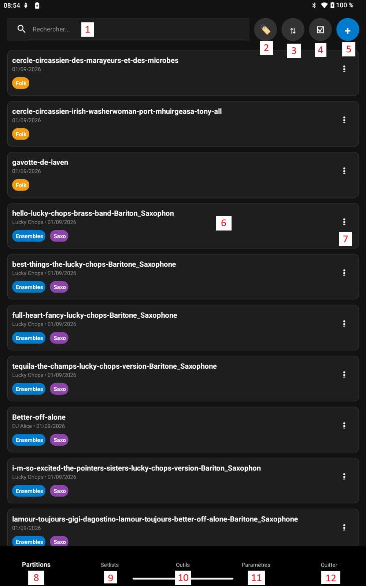
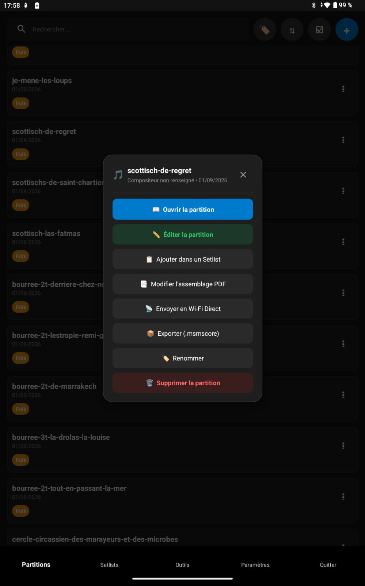
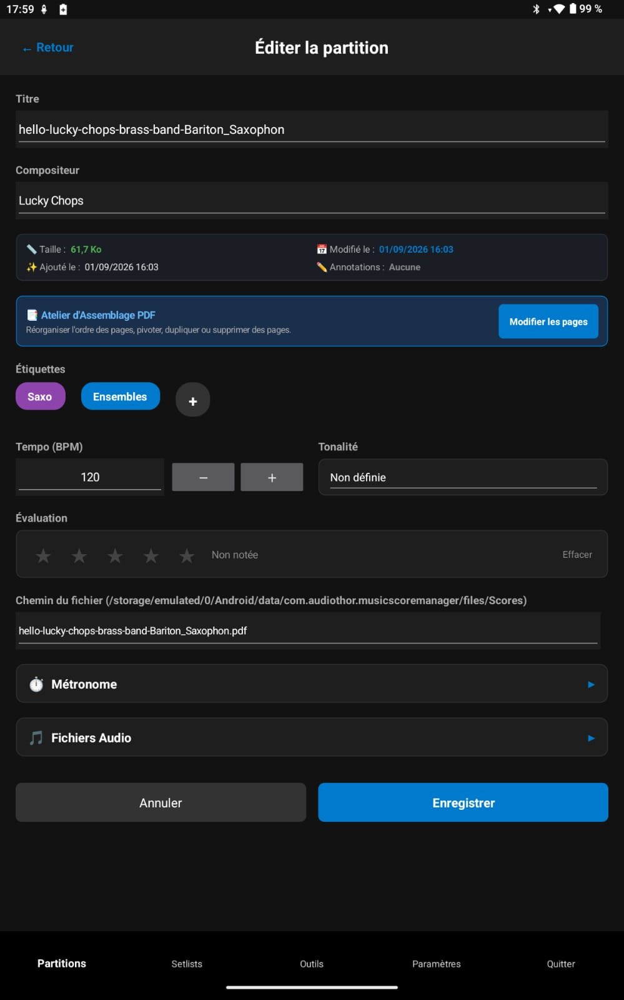

<h1 style="text-align: center;">Partitions</h1>
<h2 style="text-align: center;">Accueil</h2>

Le menu **Partitions** constitue la porte d'entrée de votre bibliothèque musicale. Il regroupe l'ensemble de vos partitions sous forme d'une grille de cartes modernes, réactives et optimisées pour les grands écrans comme pour les smartphones.

  

---

## 1. Interface principale

Cet écran s'affiche lorsque vous lancez l'application.
Si vous n'avez jamais lancé et donc importé de partitions, l'application vous signifiera que vous n'avez pas de partition à afficher.

### A. Partie haute de l'écran  - plusieurs commandes essentielles :

**[1] Barre de Recherche en Temps Réel**

- Saisissez quelques lettres pour filtrer instantanément la liste par **titre de partition**, **nom de compositeur** ou nom de fichier.
- Effacement rapide d'une touche pour retrouver la vue intégrale.

**[2] Bouton de Filtrage par Étiquettes (🏷️)**

- Ouvre le volet de sélection des tags avec recherche interne et tri des tags (A-Z, Z-A, les plus/moins utilisés).
- Affiche les étiquettes actives sous forme de carrousel horizontal avec pastilles de couleur et boutons de retrait rapide.
- Boutons *« Tout effacer »* et *« Appliquer »*.

**[3] Bouton de Tri Rapide (🔃)**

- Permet de réordonner instantanément votre bibliothèque selon :
  * **Date d'ajout (Plus récent d'abord)** : tri par défaut pour repérer immédiatement vos derniers imports.
  * **Date d'ajout (Plus ancien d'abord)**.
  * **Titre (A-Z) / Titre (Z-A)**.
  * **Date de modification (Plus récent)**.
  * **Évaluation (Meilleures notes)** : vos partitions notées de 1 à 5 étoiles classées par ordre décroissant.
  * **Compositeur (A-Z)** : ordre alphabétique des compositeurs. Un paramètre dédié dans *Paramètres > Partitions* permet de choisir si les partitions sans compositeur renseigné apparaissent au tout début ou à la fin.
  * **Sans étiquette d'abord** : place en tête les partitions qui n'ont encore aucun tag assigné pour vous aider à les classer facilement.

**[4] Bouton Multi-sélection (☑️)**

- Active le mode de sélection par lots pour appliquer des actions sur plusieurs partitions à la fois.
- Affiche une barre d'actions en bas de l'écran :
  - **🏷️ Assigner des étiquettes** : modale pour ajouter ou remplacer simultanément des tags sur toutes les partitions cochées.
  - **📡 Partager en Wi-Fi Direct** : transmettez tout le paquet sélectionné en une seule fois sans fil.
  - **📦 Exporter (.msmscores)** : génère une archive compressée unique regroupant tous les fichiers choisis (avec choix des annotations et des pistes audio).
  - **🗑️ Supprimer** : suppression groupée avec confirmation de sécurité.
  - 

**[5] Bouton Ajouter (➕)**

- **Importation de PDF** : Contrôle strict de l'intégrité binaire (`%PDF-`) empêchant tout plantage. L'import peut se faire par lot (plusieurs pdf importés en une seule fois)
- **Importation et conversion d'Images** : La sélection d'un ou plusieurs fichiers images (PNG, JPEG, GIF, WEBP, BMP) affiche un message d'information listant les fichiers images qui vont être convertis en PDF :
  * **Annuler** : Les images sont ignorées. Les éventuels PDF sélectionnés en même temps continuent leur import normal.
  * **Continuer** : Une boîte de chargement modale bloquante avec indicateur d'avancement informe l'utilisateur pendant la conversion en PDF haute netteté. Les images sont fusionnées en un seul PDF multi-pages ou converties en partitions individuelles selon le choix de l'utilisateur, puis une confirmation s'affiche dès l'import terminé.
- Lors de l'ajout de partitions depuis votre appareil, l'application propose deux modes de gestion :
  - **Copier vers la bibliothèque (Conseillé)** :  
    Le fichier PDF est copié dans le dossier interne dédié de Music Score Manager. Vos partitions restent accessibles en permanence même si le fichier original est déplacé ou supprimé de son dossier de téléchargement.
  - **Lier le fichier original (Externe)** :  
    L'application conserve le chemin d'accès absolu vers le fichier sans le dupliquer pour économiser l'espace mémoire (signalé par un badge `🔗`).

### B. Milieu de l'écran - liste des partitions référencées dans l'application

- **[6] : La partition**

Chaque partition est représentée par une carte visuelle comprenant :

  a. **Titre principal de l'œuvre**.

b. **Sous-titre personnalisable** (configurable dans les paramètres : compositeur, date d'ajout ou combinaison des deux).

c. **Pastilles d'étiquettes colorées** pour repérer les catégories au premier coup d'œil.

  **🔗 Pastille de liaison externe** si le fichier est stocké hors du dossier interne.

  **⚠️ Pastille d'alerte rouge (!) et Titre rouge** :  
Si le fichier PDF associé a été déplacé, renommé sur le stockage ou est introuvable, une pastille rouge d'avertissement avec point d'exclamation apparaît à gauche du bouton ⋮ pour vous prévenir qu'elle ne pourra pas s'ouvrir en concert.

- **[7] : Menu contextuel**
  Accès au menu contextuel d'une partition (voir le chapitre § 2 ci-dessous) 

### C. Bas de l'écran - menus principaux de l'application

- **[8] Partitions**
  Le menu actuel, en gras quand vous êtes dans ce menu

- **[9] : Setlists**
  Il gère les groupements de partitions pour un concert par exemple
  => Voir le chapitre dédié aux Setlists

- **[10] : Outils**
  A cet endroit sont disposés de multiples outils utiles pour vos partitions (transformations, imports, sauvegardes, gestion des étiquettes etc...)
  => Voir le chapitre dédié aux Outils

- **[11] : Paramètres**
  Tous les paramètres de l'applciation, des partitions, Setlists etc...
  => Voir le chapitre dédié aux Paramètres

- **[12] : Quitter**
  Tout simplement pour quitter l'application en cours
  => Voir le chapitre dédié à la fonction de Quitter

---

## 2. Menu Contextuel d'une Partition ( ⋮ )

En cliquant sur le bouton **⋮** d'une carte de partition, une carte moderne et ergonomique s'affiche :

  

1. **📖 Ouvrir la partition** :
   
   - Ouvre immédiatement la partition dans le visualiseur plein écran (mode concert).

2. **✏️ Éditer la partition** :
- Ouvre la page d'édition détaillée :

  

* **Titre** et **Compositeur / Arrangeur**.

* **Tonalité musicale** (solfège classique *Do, Ré, Mi...* et international *A, B, C...*).

* **Tempo de référence (BPM)** : valeur initiale pour le métronome.

* **Note (1 à 5 étoiles)**.

* **Étiquettes (tags)** : sélection dynamique (Pour créer des étiquettes, se rendre dans les Outils)

* **Accordéon Métronome** : chiffrage de mesure (2/4, 3/4, 4/4, 6/8...), subdivision, pré-compte et coupure/activation du son par défaut.

* **Accordéon Pistes audio** : association de fichiers audio d'accompagnement (MP3, WAV, etc.), pré-écoute et réglage du volume.

* **Informations techniques** : chemin d'accès, taille, date de modification, date d'ajout et information si des annotations ont été faites sur cette partition.
  A noter la présence d'un bouton pour réassigner le fichier en cas de déplacement.
  En cas de modifications, n'oubliez pas de cliquer sur le bouton 'Enregistrer' pour sauvegarder vos modifications.

3. **📋 Ajouter dans un Setlist** :
- Permet d'insérer instantanément la partition dans la setlist de votre choix.
- **Placement prioritaire en 1ère position** (décalant les autres morceaux vers le bas).
- Gestion des setlists verrouillées.

> 6. **📑 Modifier l'assemblage PDF** :

- Ouvre la partition directement dans l'**Atelier d'Assemblage PDF** pour réorganiser les pages, insérer une page blanche, supprimer des pages inutiles ou effectuer des rotations. Très pratique quand votre fichier pdf est mal organisé.
  Vous pouvez retrouver cet outil directement dans le menu "Outils" aussi.
  => Le détail des modifications d'assemblage est disponible plus en détail dans la partie "Outils"

> 5.**📡 Envoyer en Wi-Fi Direct** :

- Ouvre une boîte modale d'options de partage vous permettant de cocher/décocher :
  * ☑️ *Inclure les annotations manuscrites* dessinées sur le document.
  * ☑️ *Inclure les pistes audio rattachées* (MP3/WAV).
- Lance la recherche immédiate des appareils à proximité en Wi-Fi Direct P2P.
- Il est juste nécessaire que la personne qui reçoit la partition aille dans "Outils", "Transfert Wi-Fi Direct" et clique sur "Activer la Réception"
  La partition est immédiatement envoyées et incue dans le Music Score Manager de la personne qui reçoit !
  => Le détail des envois/réceptions immédiates est disponible plus en détail dans la partie "Outils"
6. **📦 Exporter la partition (.msmscore)** :
- Génère une archive (=un fichier) autonome transportable avec un choix  d'options (annotations, pistes audio) d'export.
7. **🏷️ Renommer la partition** :
- Boîte de dialogue rapide pour changer le titre affiché sans entrer dans l'édition complète.
8. **🗑️ Supprimer la partition** :
- Supprime la partition de votre bibliothèque avec demande de confirmation sécurisée.
