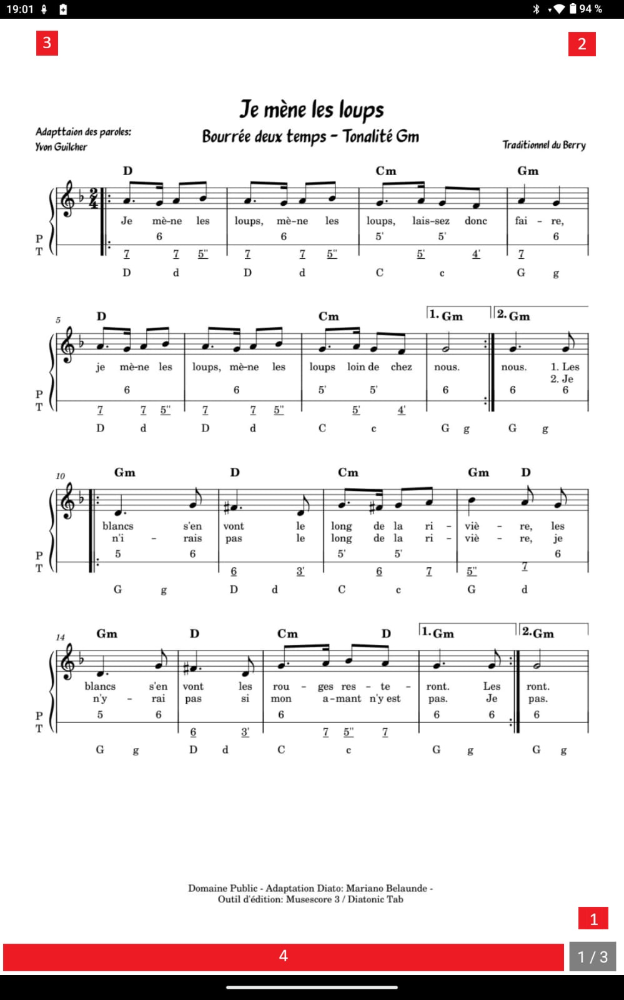
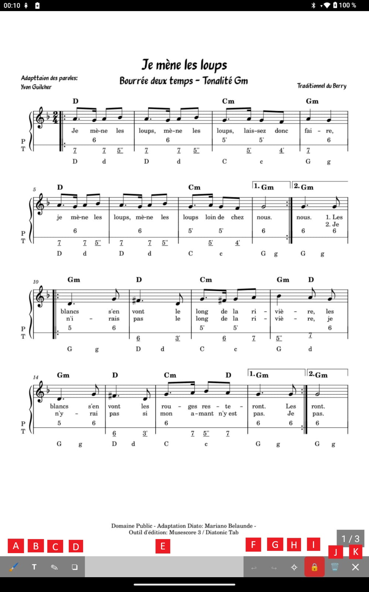

<h1 style="text-align: center;">Partitions</h1>
<h2 style="text-align: center;">Annotations</h2>

Lorsque votre **Partition** s'affiche, un calque invisible se positionne aussi sur vote partition. Ce calque vous permettra d'y apposer des annotations multiples très pratiques lors du travail de votre partition où lors de concerts.

  

---

## [1]. Numérotion des pages

Si vous avez activé l'option de numérotation des pages, cela s'affiche à cet endroit

### [2]. Métronome

Si vous avez activé l'option d'affichage du métronome, cela s'affiche à cet endroit.
Le métronome n'est pas déplaçable

### [3]. Lecteur audio

Si vous avez activé l'option d'affichage du lecteur audio (et donc uploadé un fichier audio lié à votre partition dans le menu édition), cela s'affiche à cet endroit.
Le lecteur est déplaçable à tout endroit de la partition.

### [4]. Zone de barre d'annotation

Si vous cliquez sur cette zone, la barre d'annotation s'affiche.

  

#### [A]. Surligneur

Cela vous permet de surligner des portées ou des textes de votre partition.
Avec un choix de couleurs et de tailles.

#### [B]. Texte

Cela vous permet de taper du texte libre avec un choix de couleurs et de tailles.

#### [C]. Crayon

Cela vous permet de dessiner des formes, traits.
Avec un choix de couleurs et de tailles.

#### [D]. Stickers

Un stickers est comme un petit label ou "post-it" que l'on peux glisser rapidement sur la partition à l'endroit où l'on souhaite.
Il y a plusieurs catégories pré-définies :
Doigtés, Notes, Silences, Altérations... toutes se rapportent à des notions musicales.
Mais il est aussi possible de personaliser ses stickers grâce aux "Favoris"
Les stickers "Favoris" peuvent être définis dans le menu "Paramètres" puis "Paramètres Annotation"
Les stickers peuvent avoir aussi une taille et une couleur choisies comme vous le désirez.

#### [E]. La barre de déplacement

En selectionnant cette zone vous pouvez déplacer verticalement la barre des annotations.

#### [F]. Undo

Annuler une ou plusieurs actions faites précédement

#### [G]. Redo

Refaire une ou plusieurs actions annulées précédement

#### [H]. Suppression de toutes les annotations de la partition

Cela nettoie toutes les annotations de toutes les pages de votre partition.
Une boîte de message vous demande de confirmer votre choix

#### [I]. Verouillage

L'icone du verrou de couleur rouge signifie qu'il n'est pas possible de crééer des annotations. Cela vous permet se sécuriser vos actions.
L'icone du verrou de couleur verte vous permet d'autoriser l'ajout d'annotations avec les outils précédement cités (crayon, surligneur...)
La fermeture de la barre d'annotation verouille automatiquement rendant les modifications d'annotations impossibles.

#### [J]. Suppression d'une annotation

Le symbole de la poubelle sinifie que lors d'une selection d'un élement d'annotation à l'écran, celui-ci sera supprimé.

#### [K]. Quitter la barre d'annotation

Permet d'accéder de retourner à l'utilisation classique de lecture du pdf...

**LE MENU D'ANNOTATION OUVERT EMPECHE L'UTILISATION STANDARD DE LA PARTITION (tourner les pages, ouvrir le menu du milieu etc...)**
