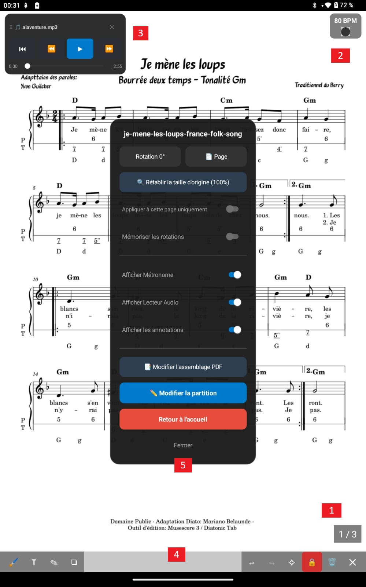

<h1 style="text-align: center;">Partitions</h1>
<h2 style="text-align: center;">Fonctions et Annotations</h2>

Voici un aperçu des fonctionnalités que vous pouvez obtenir quand vous êtes en mode Partition.
Vous n'aurez sans doute pas besoin de tout afficher cela en même temps.
En effet, sur la page de partitions vous avez accès à une multitude de fonctionnalités : Métronome, lecteur de fichiers de musique, menu d'actions immédiates, annotations...
Nous allons tout détailler.

  

---

## [1]. Numérotion des pages

Si vous avez activé l'option de numérotation des pages, cela s'affiche à cet endroit.
Pour gérer ce paramètre c'est dans le menu Paramètres puis Paramètres Partitions

### [2]. Métronome

Si vous avez activé l'option d'affichage du métronome, cela s'affiche à cet endroit avec le BPM que vous avez précisé.
Le métronome n'est pas déplaçable par contre il peut générer du son ou pas (cela dépend des paramètres que vous avez positionnés pour cette partition)

### [3]. Lecteur audio

Si vous avez activé l'option d'affichage du lecteur audio (et donc uploadé un fichier audio lié à votre partition dans le menu édition), cela s'affiche à cet endroit.
Le lecteur est déplaçable à tout endroit de la partition.
Il dispose des boutons standards d'écoute (retour au debut, pause, avance rapide etc...). Vous pouvez aussi fermez le lecteur.

### [4]. Zone de barre d'annotations

Si vous cliquez sur cette zone, la barre d'annotations s'affiche.

En effet, lorsque votre **Partition** s'affiche, un calque invisible se positionne aussi sur votre partition. Ce calque vous permettra d'y apposer des annotations multiples très pratiques lors du travail de votre partition où lors de concerts.

  

##### [A]. Surligneur

        Cela vous permet de surligner des portées ou des textes de votre partition.
        Avec un choix de couleurs et de tailles.
    

##### [B]. Texte

        Cela vous permet de taper du texte libre avec un choix de couleurs et de tailles.
        

##### [C]. Crayon

        Cela vous permet de dessiner des formes, traits.
        Avec un choix de couleurs et de tailles.
        

##### [D]. Stickers

        Un stickers est comme un petit label ou "post-it" que l'on peux glisser rapidement                         sur la partition à l'endroit où l'on souhaite.
        Il y a plusieurs catégories pré-définies :
        Doigtés, Notes, Silences, Altérations... toutes se rapportent à des notions     musicales.
        Mais il est aussi possible de personaliser ses stickers grâce aux "Favoris"
        Les stickers "Favoris" peuvent être définis dans le menu "Paramètres" puis         "Paramètres Annotation"
        Les stickers peuvent avoir aussi une taille et une couleur choisies comme vous le     désirez.
        

##### [E]. La barre de déplacement

            En selectionnant cette zone vous pouvez déplacer verticalement la barre des     annotations.

##### [F]. Undo

        Annuler une ou plusieurs actions faites précédement
        

##### [G]. Redo

        Refaire une ou plusieurs actions annulées précédement
        

##### [H]. Suppression de toutes les annotations de la partition

        Cela nettoie toutes les annotations de toutes les pages de votre partition.
    Une boîte de message vous demande de confirmer votre choix
        

##### [I]. Verrouillage

    L'icone du verrou de couleur rouge signifie qu'il n'est pas possible de crééer des     annotations. Cela vous permet se sécuriser vos actions.
    L'icone du verrou de couleur verte vous permet d'autoriser l'ajout d'annotations avec les outils précédement cités (crayon, surligneur...)
    La fermeture de la barre d'annotation verouille automatiquement rendant les     modifications d'annotations impossibles.

##### [J]. Suppression d'une annotation

    Le symbole de la poubelle sinifie que lors d'une selection d'un élement d'annotation     à l'écran, celui-ci sera supprimé.
    

##### [K]. Quitter la barre d'annotation

    Permet d'accéder de retourner à l'utilisation classique de lecture du pdf...

##### Sauvegarde

Il n'y a pas de bouton de sauvegarde, toutes vos actions avec la barre d'annotations sont prises en compte et sauvegardées.

##### Verouillage

##### **LE MENU D'ANNOTATION OUVERT EMPECHE L'UTILISATION STANDARD DE LA PARTITION (tourner les pages, ouvrir le menu du milieu etc...)**

### [5]. Menu central de partition

Ce menu est accessible par un double touché/clic dans la partie centrale de l'écran.

. Il redonne le titre de la partition actuelle

. Il permet de faire appliquer une ou plusieurs rotation à la page de partition en cours

.Page : permet d'accéder à une page de partition choisie

. Rétablir la taille d'origine permet remettre la page en affichage d'orignie (annule tous les zoom + et - )

. Appliquer à cette page ou non (toute la partition)

. Mémoriser les rotations (permet de retenir les configurations de rotations apportées pour les prochaines ouvertures de cette partition)

. Afficher Métronome : affiche le métronome à l'écran ou pas

. Afficher Lecteur Audio : affiche le lecteur audio à l'écran ou pas

. Afficher les annotations : permet de cacher ou pas les annotations de la partition (attention, cela ne les supprime pas)

. Modifier l'assemblage PDF : permet d'accéder directement à l'outil de reorganisation du fichier PDF (rotation, ordre, suppression)

. Modifier la partition : permet d'accéder à l'édition de configuration de la partition

. Retour à l'acceuil : Reviens au menu précédent d'où la partition a été ouverte

. Fermer : Ferme ce petit menu
