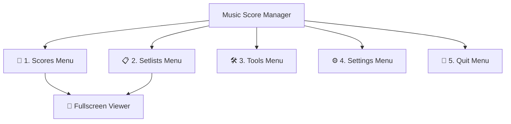

# User Manual - Music Score Manager

Welcome to the comprehensive, in-depth documentation for **Music Score Manager**, the cross-platform application (Android / Windows / iOS / macOS) tailor-made for solo musicians, ensembles, choirs, and orchestras.

---

## 🎯 Application Overview

The app is structured around **5 primary tabs** in the bottom navigation bar, complemented by the dedicated **Fullscreen Stage Mode Viewer**:

1. **🎵 Scores Menu**: Your complete digital music library. Import PDFs, categorize with multi-tags, sort by composers or dates, and customize score metadata.
2. **📋 Setlists Menu**: Rehearsal and concert performance planner. Arrange songs in order, start stage performance with a single tap, and duplicate setlists in seconds.
3. **📖 Sheet Music Viewer**: The stage companion. Seamless page turns, pinch-to-zoom, central quick menu, persistent rotations, annotation suite, precision metronome, and audio accompaniment.
4. **🛠️ Tools Menu**: The powerhouse utility box. PDF Assembler Studio, Wi-Fi Direct P2P & QR Code group broadcasts without internet, tag management, duplicate finder, package imports, and database backups.
5. **⚙️ Settings Menu**: In-depth app customization. Default sort behaviors, card display subtitles, turn page gestures, favorite stickers, directory paths, and 8 selectable languages.
6. **🚪 Quit Menu**: Graceful application exit with automatic session persistence.

---

## 🧭 Detailed Guide Contents

Explore every feature and menu thoroughly:

- [🎵 Scores Menu Guide](guide/scores.md)
- [📋 Setlists Menu Guide](guide/setlists.md)
- [📖 Viewer & Stage Mode Guide](guide/viewer.md)
- [🛠️ Tools Menu Guide](guide/tools.md)
- [⚙️ Settings Menu Guide](guide/settings.md)
- [🚪 Quit Menu Guide](guide/quit.md)
- [🔒 Privacy Policy](confidentialite.md)
