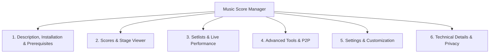

# User Manual - Music Score Manager

Welcome to the comprehensive, in-depth documentation for **Music Score Manager v2.0.2**, the cross-platform application (Android / Windows) tailor-made for solo musicians, ensembles, choirs, and orchestras.

---

## 📑 6-Chapter Documentation Structure

The official user manual and documentation are strictly organized around 6 comprehensive chapters:

1. **[Chapter 1: Full Description of the App, Installation & Prerequisites](guide/scores.en.md)**  
   Philosophy, highlights, 100% offline autonomy, zero latency (< 50ms), stage-optimized Dark Mode, hardware requirements (Android 12+, Windows 10/11), and installation / build procedures.

2. **[Chapter 2: Scores — Actions, Library & Fullscreen Stage Viewer](guide/scores.en.md)**  
   Real-time search, tag filtering, multi-criteria sorting, batch multi-selection, PDF / image imports (smart multi-image fusion into multi-page PDF), score card indicators, context menu (⋮), complete metadata editing, and the fullscreen stage viewer ([`ViewerPage`](guide/viewer.en.md)) featuring 2-page landscape mode with geometric projection, full annotation suite (chiseled highlighter, pencil, text, musical stickers), thread-safe regulated metronome, audio backing track player, and double-tap quick menu.

3. **[Chapter 3: Setlists — Program Planning & Live Stage Flow](guide/setlists.en.md)**  
   Concert planning, status filters (Active, Upcoming, Completed), direct one-tap start, 1-click setlist duplication, concert lock mode, and the **Live Setlist Progress Drawer (v2.0.1.1)** with automatic scrolling/centering on the current piece and color-coded status badges.

4. **[Chapter 4: Tools — Advanced Utility Studio](guide/tools.en.md)**  
   PDF Assembler Studio ([`PdfAssemblerPage`](guide/tools.en.md)), Wi-Fi Direct P2P & QR Code group broadcasts without internet ([`WifiTransferPage`](guide/tools.en.md)), tag management with RGB mixer ([`TagsPage`](guide/tools.en.md)), package imports (`.msmsetlist`, `.msmscore`, `.msmscores`), duplicate detection via SHA-256 binary hash ([`DuplicatesPage`](guide/tools.en.md)), and database backup & restore ([`BackupsPage`](guide/tools.en.md)).

5. **[Chapter 5: Settings — Configuration & Preferences](guide/settings.en.md)**  
   Score settings (sorting, gestures, 2-page landscape mode, page number badge), Setlist settings (continuous play, progress drawer toggle), Annotation settings (custom favorite stickers & active sticker categories), Bluetooth Pedals & MIDI Events ([`SettingsPedalsPage`](guide/settings.en.md)) with real-time signal monitor, factory profiles, Learn mode, and long-press sensitivity, and App settings (8 built-in languages, available disk space, SQLite database size, and USB-accessible storage folders).

6. **[Chapter 6: Technical Details, Privacy, Rights & GitHub Links](confidentialite.en.md)**  
   Software architecture (.NET 10 MAUI, SQLite WAL, Mozilla PDF.js, SoundPool), transparent Android permissions, strict zero-data privacy policy (0 data collected, 0 telemetry, 100% local storage), free GNU General Public License v3.0 (GPLv3), and official GitHub project links.

---

## 🧭 Quick Access to Guides

- [🎵 Scores Menu Guide](guide/scores.en.md)
- [📖 Viewer & Stage Mode Guide](guide/viewer.en.md)
- [📋 Setlists Menu Guide](guide/setlists.en.md)
- [🛠️ Tools Menu Guide](guide/tools.en.md)
- [⚙️ Settings Menu Guide](guide/settings.en.md)
- [🚪 Quit Menu Guide](guide/quit.en.md)
- [🔒 Privacy Policy & Legal Notice](confidentialite.en.md)
