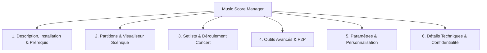

# Manuel d'Utilisation - Music Score Manager

Bienvenue sur la documentation complète et détaillée de **Music Score Manager v2.0.4**, l'application multiplateforme (Android / Windows) conçue sur mesure pour les musiciens solistes, ensembles, chorales et orchestres.

---

## 📑 Structure de la Documentation en 6 Chapitres

Le manuel d'utilisation et la documentation officielle sont organisés rigoureusement selon les 6 chapitres fondamentaux :

1. **[Chapitre 1 : Description Complète de l'Application, Installation & Prérequis](guide/scores.md)**  
   Philosophie, points forts, 100% hors-ligne, zéro latence, Dark Mode scénique, prérequis système (Android 12+, Windows 10/11) et procédures d'installation / compilation.

2. **[Chapitre 2 : Partitions — Actions, Bibliothèque & Visualiseur de Scène](guide/scores.md)**  
   Recherche en direct, filtrage par étiquettes, tri multi-critères, mode multi-sélection, import PDF / images (fusion intelligente en PDF multi-pages), menu contextuel (⋮), métadonnées complètes ([`ScoreEditPage`](guide/scores.md#menu-contextuel-dune-partition-3-petits-points)) et visualiseur plein écran ([`ViewerPage`](guide/viewer.md)) avec mode 2 pages paysage, annotations complètes (surligneur Stabilo biseauté, crayon, texte, stickers), métronome régulé thread-safe, lecteur audio et menu central au double-tap.

3. **[Chapitre 3 : Setlists — Organisation des Programmes & Déroulement Scénique](guide/setlists.md)**  
   Création de programmes, filtres par statut (Active, À venir, Terminée), démarrage immédiat au tap, duplication de setlist, verrouillage concert et le **Volet Déroulement de la Setlist en Direct (v2.0.1.1)** avec centrage automatique et statuts colorés.

4. **[Chapitre 4 : Outils — Boîte à Utilitaires Avancés](guide/tools.md)**  
   Atelier d'assemblage PDF ([`PdfAssemblerPage`](guide/tools.md#1-createur-assemblage-pdf-atelier-studio)), transfert Wi-Fi Direct P2P et diffusion groupe QR Code ([`WifiTransferPage`](guide/tools.md#2-transfert-wi-fi-direct-p2p-diffusion-groupe)), gestionnaire d'étiquettes avec sélecteur RVB ([`TagsPage`](guide/tools.md#3-gestion-des-etiquettes-tags)), imports de paquets (`.msmsetlist`, `.msmscore`, `.msmscores`), détection de doublons par empreinte SHA-256 ([`DuplicatesPage`](guide/tools.md#5-gestion-des-doublons)) et sauvegardes / restaurations ([`BackupsPage`](guide/tools.md#6-gestion-des-sauvegardes-restauration)).

5. **[Chapitre 5 : Paramètres — Configuration & Personnalisation](guide/settings.md)**  
   Paramètres Partitions (tris, gestes, affichage 2 pages, compteur de page), Paramètres Setlists (lecture continue, déroulement scénique), Paramètres Annotations (stickers favoris et sélection des catégories actives), Paramètres Pédaliers Bluetooth & Événements MIDI ([`SettingsPedalsPage`](guide/settings.md#5-parametres-pedaliers-bluetooth-evenements-midi) avec diagnostic direct, profils constructeurs, mode apprentissage et réactivité d'appui long), et Paramètres Application (8 langues intégrées, espace disque disponible, taille SQLite et dossiers publics).

6. **[Chapitre 6 : Détails Techniques, Confidentialité, Droits & Liens GitHub](confidentialite.md)**  
   Architecture logicielle (.NET 10 MAUI, SQLite WAL, Mozilla PDF.js, SoundPool), permissions Android transparentes, politique de confidentialité stricte (0 donnée collectée, 0 télémétrie, 100% stockage local), licence libre GNU General Public License v3.0 (GPLv3) et liens officiels vers le projet GitHub.

---

## 🧭 Accès Rapide aux Guides Détaillés

- [🎵 Guide Complet du Menu Partitions](guide/scores.md)
- [📖 Guide Détaillé du Visualiseur Plein Écran](guide/viewer.md)
- [📋 Guide Complet du Menu Setlists](guide/setlists.md)
- [🛠️ Guide Complet du Menu Outils](guide/tools.md)
- [⚙️ Guide Complet du Menu Paramètres](guide/settings.md)
- [🚪 Guide du Menu Quitter](guide/quit.md)
- [🔒 Politique de Confidentialité & Mentions Légales](confidentialite.md)
