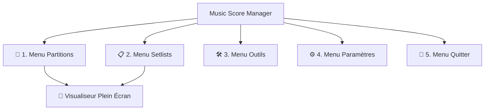

# Manuel d'Utilisation - Music Score Manager

Bienvenue sur la documentation complète et détaillée de **Music Score Manager**, l'application multiplateforme (Android / Windows / iOS / macOS) conçue sur mesure pour les musiciens solistes, ensembles, chorales et orchestres.

---

## 🎯 Vue d'Ensemble de l'Application

L'application est organisée autour de **5 onglets principaux** accessibles depuis la barre de navigation inférieure, complétés par le **Visualiseur Plein Écran (Mode Scène)** :

1. **🎵 Menu Partitions** : Votre bibliothèque musicale complète. Importez des PDF, organisez par tags, triez par compositeurs ou dates, et gérez vos métadonnées musicales.
2. **📋 Menu Setlists** : La préparation de vos concerts et répétitions. Classez vos morceaux dans l'ordre de passage, lancez le concert d'un simple toucher et dupliquez vos listes.
3. **📖 Visualiseur de Partitions** : Le cœur de scène. Tourne de page fluide, zoom tactile, double-tap central, mémorisation des rotations, annotations complètes, métronome ultra-précis et lecteur audio synchronisé.
4. **🛠️ Menu Outils** : La boîte à outils avancée. Atelier d'assemblage PDF, transferts Wi-Fi Direct P2P et diffusion QR Code sans réseau, gestionnaire d'étiquettes, détection de doublons, import de paquets et sauvegardes.
5. **⚙️ Menu Paramètres** : La personnalisation approfondie. Préférences de tri, options d'affichage des cartes, gestes de navigation, stickers favoris, gestion des dossiers et choix parmi 8 langues.
6. **🚪 Menu Quitter** : Fermeture propre de l'application avec enregistrement automatique de votre session.

---

## 🧭 Sommaire du Guide Détaillé

Explorez chaque menu en détail via les sections ci-dessous :

- [🎵 Guide Complet du Menu Partitions](guide/scores.md)
- [📋 Guide Complet du Menu Setlists](guide/setlists.md)
- [📖 Guide du Visualiseur & Mode Concert](guide/viewer.md)
- [🛠️ Guide Complet du Menu Outils](guide/tools.md)
- [⚙️ Guide Complet du Menu Paramètres](guide/settings.md)
- [🚪 Guide du Menu Quitter](guide/quit.md)
- [🔒 Politique de Confidentialité](confidentialite.md)
