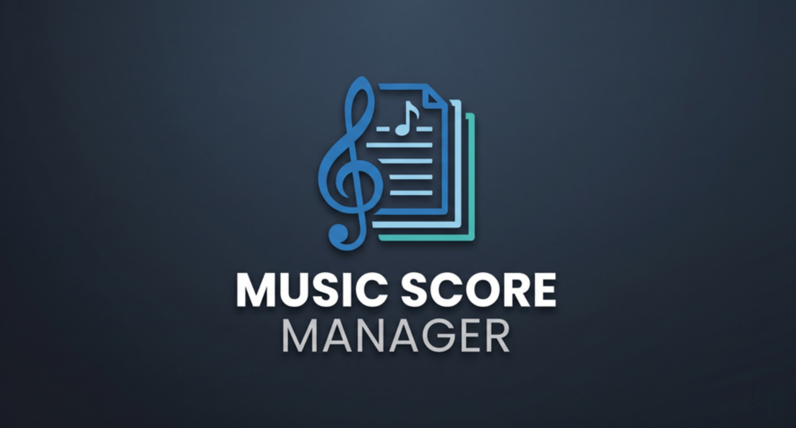

<h1 style="text-align: center;">Music Score Manager</h1>

  

Bienvenue sur la documentation complète et détaillée de **Music Score Manager** !

Cette application est **GRATUITE et SANS PUBLICITE**
Elle ne nécessite pas internet, n'a aucun lien sur le Cloud.
Elle est multiplateforme (Android / Windows).

**Music Score Manager** a été conçue sur mesure pour les musiciens solistes, ensembles, chorales et orchestres avec les remarques de musiciens issus de conservatoires, harmonies, groupes de musique et autodidactes.

**Music Score Manager gère** vos bibliothèques de partitions et vous permet de les lire en live et d'annoter, préparer une liste de déroulement pour un concert...etc..

**Music Score Manager ne gère pas** les modifications directes des notes ou partitions, ne fait pas de transposition, de modification type MIDI ou de lecture de notes.

---

## Table des matières

- [Description, prérequis et installation](guide/installation.md)
- [Guide général de l'application](guide/viewer.md)
- [Partitions](guide/scores.md)
- [Setlists](guide/setlists.md)
- [Outils](guide/tools.md)
- [Paramètres](guide/settings.md)
- [Quitter](guide/quit.md)
- [Politique de Confidentialité & Mentions Légales](confidentialite.md)

*Music Score Manager est Open source avec un code totalement transparent et disponible sous Github.
Music Score Manager est développé en France.*
