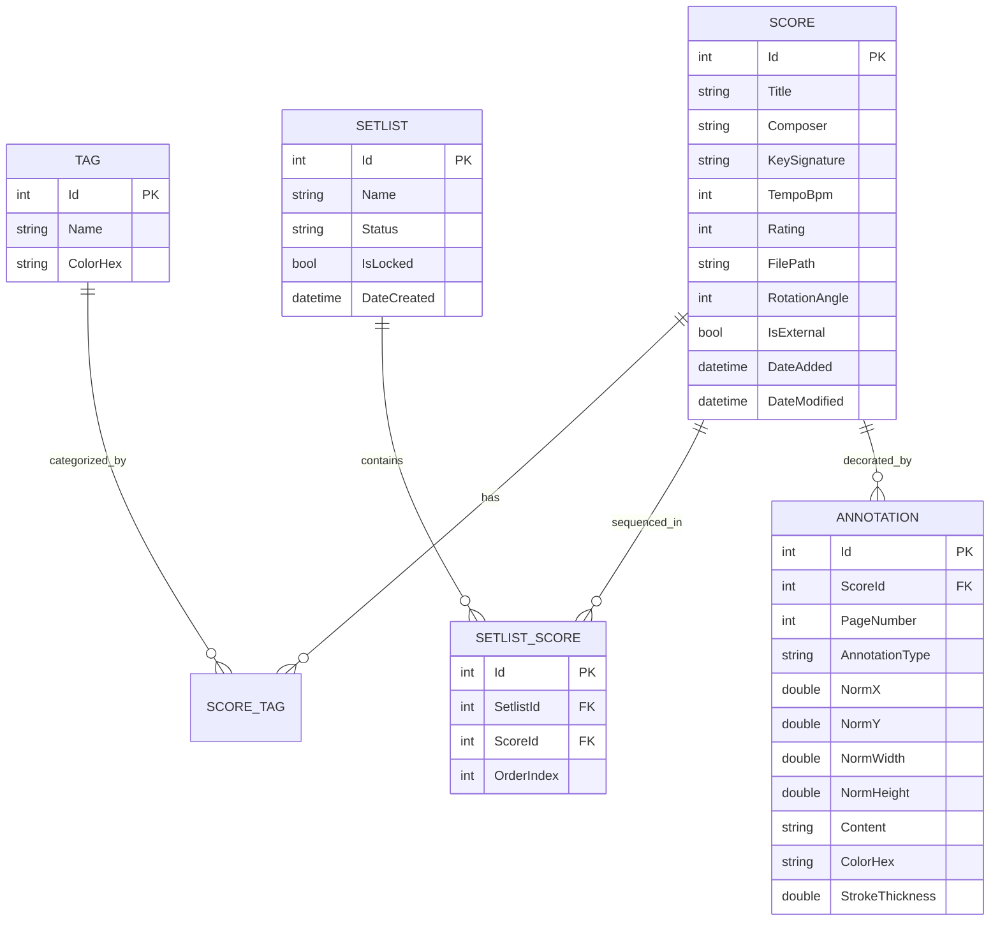
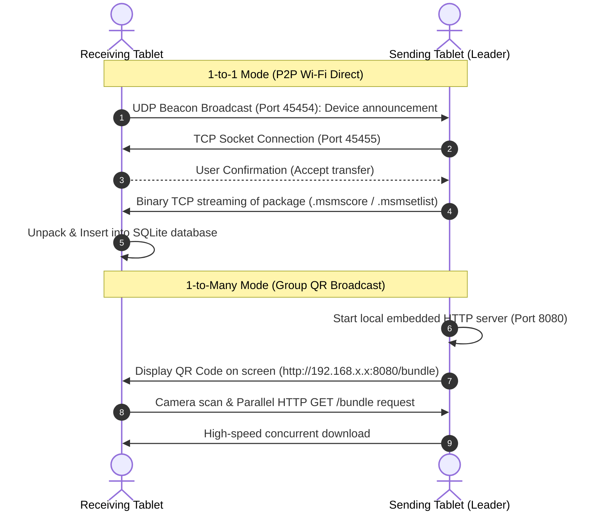

> [🇫🇷 Version Française](Architecture-&-Internals) | **🇬🇧 English**

# 🔬 Software Architecture & Protocols

This document details the software engineering decisions, container archive specifications, persistence schema, and networking protocols of Music Score Manager.

---

## 1. SQLite Relational Schema (`scores.db3`)

Data persistence is powered by a high-performance SQLite database accessed via `sqlite-net-pcl` with **Write-Ahead Logging (WAL)** enabled (`PRAGMA journal_mode=WAL;`).



### Benefits of Write-Ahead Logging (WAL)
- **Crash Resilience**: If a tablet runs out of battery on stage, no database corruption occurs. Unfinished transactions roll back cleanly upon reboot.
- **Lock-Free Concurrency**: Reading scores and annotations never blocks background writes (such as auto-backups, file hash audits, or disk storage metric computations).

---

## 2. Standalone Package Specifications (`.msm*`)

Files with extensions `.msmscore`, `.msmscores`, and `.msmsetlist` are standardized compressed containers (ZIP format) structured as follows:

```
my_concert.msmsetlist
├── manifest.json            # Metadata, sequence order, format version, and options
├── scores/
│   ├── beethoven_op27.pdf   # Score PDF 1
│   └── chopin_nocturne.pdf  # Score PDF 2
├── annotations/
│   ├── beethoven_op27.json  # Vector annotation layers for piece 1
│   └── chopin_nocturne.json # Vector annotation layers for piece 2
└── audio/
    └── backing_orchestra.mp3 # Attached audio files (optional)
```

### Sample `manifest.json`:
```json
{
  "formatVersion": "2.0",
  "appVersion": "2.0.1.1",
  "packageType": "Setlist",
  "createdDate": "2026-09-11T21:30:00Z",
  "setlist": {
    "name": "Symphony Concert",
    "status": "Active",
    "scores": [
      {
        "order": 1,
        "title": "Moonlight Sonata",
        "composer": "L. v. Beethoven",
        "fileName": "beethoven_op27.pdf",
        "tempo": 54,
        "key": "C# Minor",
        "hasAnnotations": true,
        "hasAudio": false
      }
    ]
  }
}
```

---

## 3. P2P Wireless Networking & Broadcast Protocols

Music Score Manager operates completely offline using ad-hoc networking:



---

## 4. Geometric Normalized Coordinate Engine

To ensure an annotation (arrow, dynamic marking, fingering, or highlighter stroke) stays **rigidly aligned to musical notes**, regardless of:
- Screen orientation (Portrait vs Dual-page Landscape),
- Zoom level (100% to 400%) or pan offset,
- Device aspect ratio (16:9, 16:10, 4:3, 3:2),

The app **never stores raw screen pixel coordinates**.

### Normalization Formula (Storage):
$$\text{NormX} = \frac{X_{\text{touch}} - X_{\text{page\_margin}}}{\text{Width}_{\text{pdf\_page}}}$$
$$\text{NormY} = \frac{Y_{\text{touch}} - Y_{\text{page\_margin}}}{\text{Height}_{\text{pdf\_page}}}$$

Normalized values are floating-point numbers between `0.0` and `1.0`.

### Projection Formula (2-Page Landscape View):
When viewing two pages side by side, the engine detects whether an annotation belongs to the left (`leftPage`) or right (`rightPage`) page and calculates:
$$X_{\text{screen}} = X_{\text{page\_offset}} + (\text{NormX} \times \text{RenderedWidth}_{\text{page}})$$
$$Y_{\text{screen}} = Y_{\text{page\_offset}} + (\text{NormY} \times \text{RenderedHeight}_{\text{page}})$$

This system guarantees millimeter precision between editing on a phone and performing on a 13-inch tablet.
