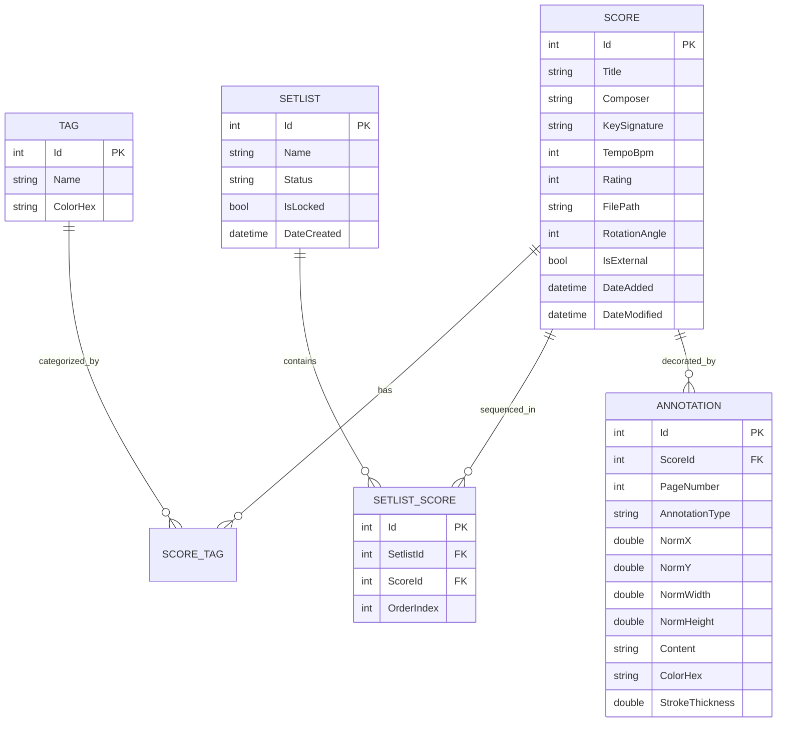
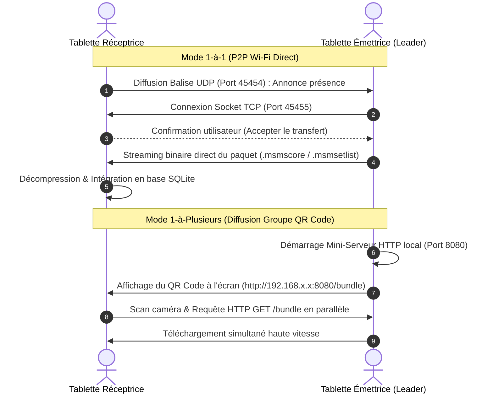

> **🇫🇷 Français** | [🇬🇧 English Version](Architecture-&-Internals-EN)

# 🔬 Architecture Interne & Spécifications des Protocoles

Ce document détaille les choix d'ingénierie logicielle, les formats de conteneurs, le schéma relationnel de persistance et les protocoles réseau de Music Score Manager.

---

## 1. Schéma Relationnel SQLite (`scores.db3`)

La persistance des données repose sur une base SQLite optimisée accédée via `sqlite-net-pcl` avec le mode **Write-Ahead Logging (WAL)** activé (`PRAGMA journal_mode=WAL;`).



### Avantages du Mode WAL (Write-Ahead Logging)
- **Tolérance aux Pannes** : Si la batterie de la tablette s'éteint subitement pendant un concert, aucune donnée n'est corrompue. Les transactions incomplètes sont automatiquement rollbackées au redémarrage.
- **Accès Concurrent Sans Blocage** : Les lectures de partitions et d'annotations ne bloquent jamais les opérations d'écriture en arrière-plan (sauvegardes automatiques, calculs de hash ou de statistiques de stockage).

---

## 2. Spécification des Archives Autonomes (`.msm*`)

Les fichiers `.msmscore`, `.msmscores` et `.msmsetlist` sont des archives compressées standardisées (format conteneur ZIP) dont la structure interne est la suivante :

```
mon_programme.msmsetlist
├── manifest.json            # Métadonnées, liste ordonnée, versions et options
├── scores/
│   ├── beethoven_op27.pdf   # Document PDF 1
│   └── chopin_nocturne.pdf  # Document PDF 2
├── annotations/
│   ├── beethoven_op27.json  # Calques vectoriels d'annotations du morceau 1
│   └── chopin_nocturne.json # Calques vectoriels d'annotations du morceau 2
└── audio/
    └── backing_orchestra.mp3 # Pistes audio rattachées (en option)
```

### Exemple de `manifest.json` :
```json
{
  "formatVersion": "2.0",
  "appVersion": "2.0.2",
  "packageType": "Setlist",
  "createdDate": "2026-09-11T21:30:00Z",
  "setlist": {
    "name": "Concert Philharmonique",
    "status": "Active",
    "scores": [
      {
        "order": 1,
        "title": "Sonate Clair de Lune",
        "composer": "L. v. Beethoven",
        "fileName": "beethoven_op27.pdf",
        "tempo": 54,
        "key": "C# Minor",
        "hasAnnotations": true,
        "hasAudio": false
      }
    ]
  }
}
```

---

## 3. Protocoles Réseau P2P & Diffusion Wi-Fi

Music Score Manager intègre sa propre pile de communication sans fil fonctionnant indépendamment d'Internet :



---

## 4. Moteur de Projection Géométrique Normalisée des Annotations

Pour garantir qu'une annotation (flèche, nuance, doigté ou trait de surligneur) reste **parfaitement positionnée sur la note de musique**, quel que soit :
- L'orientation de l'écran (Portrait ou Paysage double-page),
- Le niveau de zoom (100% à 400%) ou déplacement panoramique,
- Le ratio d'écran de l'appareil (16:9, 16:10, 4:3, 3:2),

L'application n'enregistre **jamais de coordonnées en pixels bruts d'écran**.

### Formule de Normalisation (Enregistrement) :
$$\text{NormX} = \frac{X_{\text{touch}} - X_{\text{page\_margin}}}{\text{Largeur}_{\text{page\_pdf}}}$$
$$\text{NormY} = \frac{Y_{\text{touch}} - Y_{\text{page\_margin}}}{\text{Hauteur}_{\text{page\_pdf}}}$$

Les coordonnées sont stockées sous forme de nombres flottants compris entre `0.0` et `1.0`.

### Formule de Rendu (Mode 2 Pages Paysage) :
Lors de l'affichage côte à côte, le moteur détecte si l'annotation appartient à la page paire (`leftPage`) ou impaire (`rightPage`) et applique le décalage dynamique :
$$X_{\text{screen}} = X_{\text{page\_offset}} + (\text{NormX} \times \text{Largeur}_{\text{rendu\_page}})$$
$$Y_{\text{screen}} = Y_{\text{page\_offset}} + (\text{NormY} \times \text{Hauteur}_{\text{rendu\_page}})$$

Ce système garantit une fidélité d'affichage absolue entre une répétition sur smartphone et un concert sur tablette 13 pouces.
